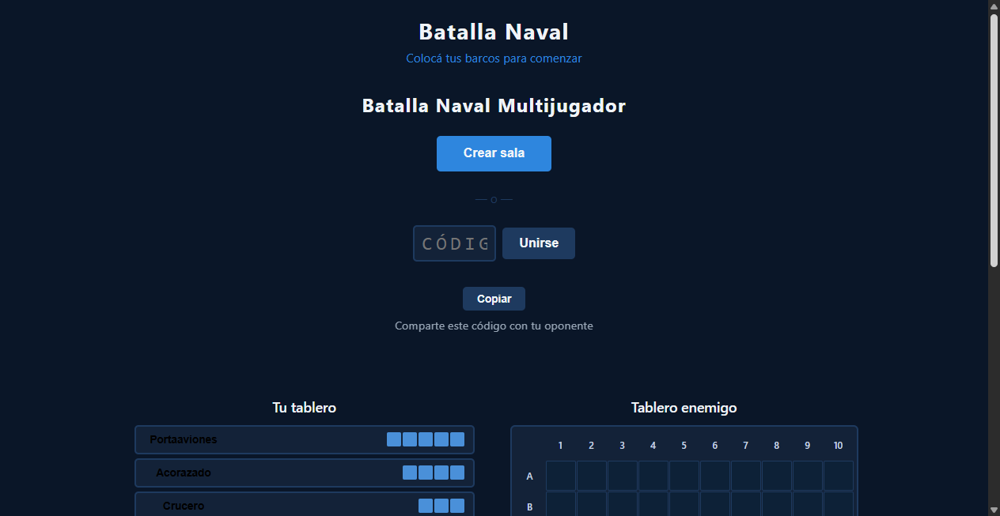

# Bug Fix: Lobby no se oculta al transicionar al juego

**ADW ID:** 07fdz4m
**Fecha:** 2026-02-20
**Especificación:** specs/bug-21-lobby-no-se-oculta-transicion.md

## Resumen

Se corrigió un bug donde el lobby (`#lobby`) permanecía visible superpuesto al tablero de juego cuando ambos jugadores se conectaban a una sala. La causa raíz era que `hideScreen()` dependía del evento `transitionend`, el cual nunca se disparaba porque el lobby nunca pasaba por `showScreen()` y por tanto carecía de la clase `screen-visible` necesaria para que el navegador detectara un cambio real de opacidad.

## Screenshots




## Lo Construido

- Corrección de la función `hideScreen` en `js/game.js` para manejar el caso donde el elemento nunca fue mostrado via `showScreen`
- Cortocircuito inmediato (`el.hidden = true`) cuando el elemento no tiene la clase `screen-visible`, evitando esperar un `transitionend` que nunca llegará
- Las transiciones de fade-out para pantallas que sí pasan por `showScreen` (game-container → end-screen) continúan funcionando sin cambios

## Implementación Técnica

### Archivos Modificados
- `js/game.js`: Modificada la función `hideScreen` con un guard al inicio de la función

### Cambios Clave

**Antes** — `hideScreen` siempre intentaba la transición de opacidad:
```js
function hideScreen(el) {
  if (!el || el.hidden) return;
  el.classList.add('screen-transition');
  el.classList.remove('screen-visible'); // lobby nunca tuvo esta clase → sin cambio de opacity
  el.addEventListener('transitionend', function handler() {
    // ← este handler nunca se ejecutaba para el lobby
    el.removeEventListener('transitionend', handler);
    el.hidden = true;
    el.classList.remove('screen-transition', 'screen-entering');
  }, { once: true });
}
```

**Después** — `hideScreen` detecta si la transición es posible:
```js
function hideScreen(el) {
  if (!el || el.hidden) return;
  if (!el.classList.contains('screen-visible')) {
    el.hidden = true;  // ← ocultar directamente, sin esperar transitionend
    return;
  }
  el.classList.add('screen-transition');
  el.classList.remove('screen-visible');
  el.addEventListener('transitionend', function handler() {
    el.removeEventListener('transitionend', handler);
    el.hidden = true;
    el.classList.remove('screen-transition', 'screen-entering');
  }, { once: true });
}
```

## Cómo Usar

1. Abrir el juego en dos pestañas del navegador (`http://localhost:8000`)
2. En la primera pestaña, hacer clic en "Crear sala"
3. En la segunda pestaña, ingresar el código y hacer clic en "Unirse"
4. Al conectarse ambos jugadores, el lobby desaparece y el tablero de juego queda visible correctamente

## Pruebas

### Verificación del fix
Tras unirse a la sala, abrir DevTools y ejecutar:
```js
document.getElementById('lobby').hidden          // → true (corregido)
document.getElementById('game-container').hidden // → false (game visible)
```

### Prueba de regresión
- Transición al final de la partida (combat → end screen): `hideScreen(gameContainer)` — `gameContainer` tiene `screen-visible` en ese momento, por lo que el flujo `transitionend` continúa funcionando normalmente
- Recarga de página: el estado inicial del lobby es correcto
- Viewport reducido (mobile): sin superposición de elementos

## Notas

- El fix es de **3 líneas adicionales** en una sola función (`hideScreen`)
- Aplica a ambos jugadores: player1 (espera `onPlayerJoined`) y player2 (llama `handleBothConnected` directamente tras `joinRoom`)
- No se modificaron estilos CSS ni HTML — el cambio es exclusivamente en la lógica de JS
- La solución evita timeouts arbitrarios, resolviendo la causa raíz directamente
