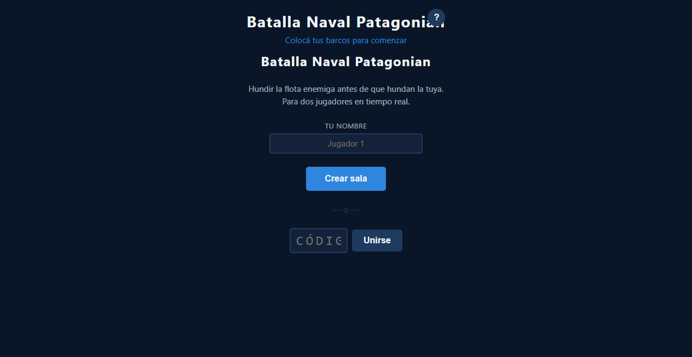
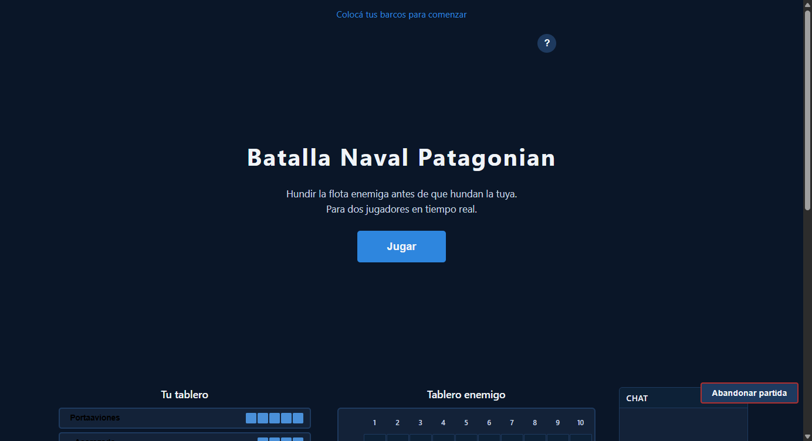
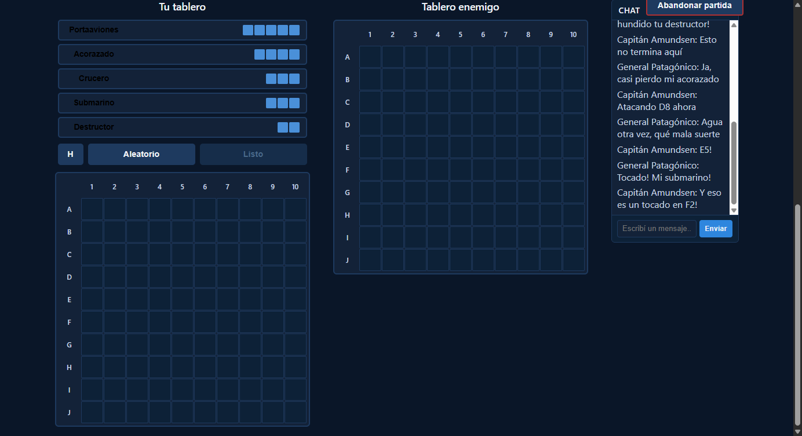
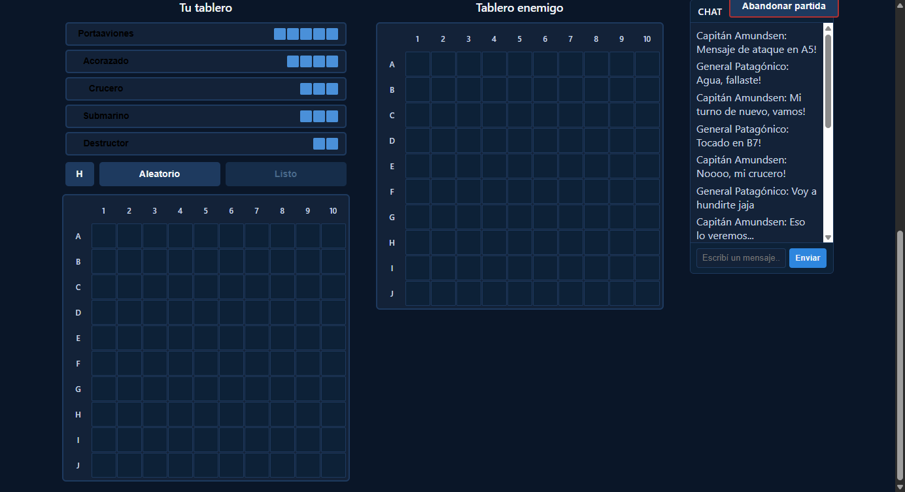
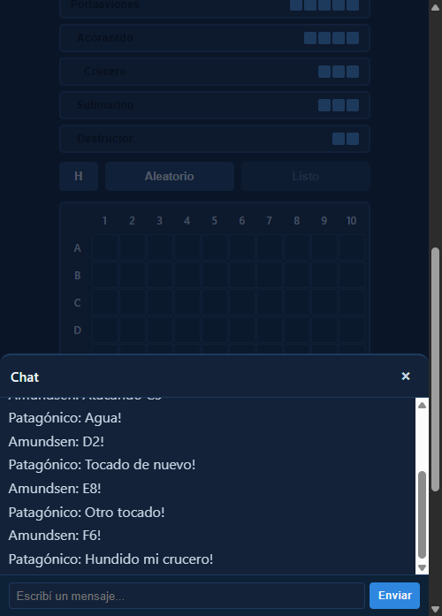

# Bug Fix: Panel de Chat Sin Scroll (Crece Indefinidamente)

**ADW ID:** 0f6beqe
**Fecha:** 2026-02-26
**Especificación:** specs/bug-53-chat-panel-scroll.md

## Resumen

El panel de chat desktop (`.chat-column`) y el overlay mobile (`#chat-overlay-messages`) crecían en altura indefinidamente al recibir mensajes, deformando el layout del juego. La corrección aplica altura fija al contenedor desktop y `max-height` + `overflow-y: auto` al overlay mobile, activando el scroll interno que ya estaba implementado en JS.

## Screenshots

## Lo Construido

- Corrección del panel de chat desktop para mantener altura fija de 420px
- Activación del scroll interno en `.chat-messages` al limitar el contenedor padre
- Corrección del overlay mobile con `max-height: 200px` y `overflow-y: auto`
- El scroll automático al último mensaje (ya implementado en JS) ahora funciona correctamente

## Implementación Técnica

### Archivos Modificados
- `css/styles.css`: Único archivo modificado — reglas `.chat-column` e `#chat-overlay-messages`

### Cambios Clave
- **`.chat-column`**: Reemplazado `min-height: 420px` por `height: 420px` para que el contenedor sea rígido y su hijo `flex: 1` quede contenido, activando `overflow-y: auto` en `.chat-messages`
- **`#chat-overlay-messages`**: Cambiado `min-height: 120px` por `max-height: 200px` y agregado `overflow-y: auto` para limitar la altura del overlay mobile con scroll interno
- El código JS de scroll automático (`scrollTop = scrollHeight`) en `game.js:767-771` ya existía y comienza a funcionar correctamente con estas correcciones CSS

## Cómo Usar

1. Abrir el juego en dos pestañas y unirse a la misma sala
2. Llegar a la fase de combate
3. Enviar múltiples mensajes — el panel se mantiene en 420px y los mensajes se desplazan internamente
4. Los mensajes nuevos hacen scroll automático al fondo del panel

## Configuración

No requiere configuración adicional. El fix es puramente CSS.

## Pruebas

1. Iniciar servidor: `python -m http.server 8000`
2. Abrir dos pestañas en `http://localhost:8000`, crear sala y llegar a fase de combate
3. Enviar 8+ mensajes en el chat desktop — verificar que el panel mantiene 420px de altura y activa scroll interno
4. Verificar que el scroll baja automáticamente al último mensaje recibido
5. En mobile, abrir el overlay de chat y enviar varios mensajes — verificar que el área de mensajes no supera 200px con scroll interno

## Notas

- La causa raíz era que `min-height` permite que el contenedor crezca sin límite, impidiendo que `overflow-y: auto` del hijo se active. Usar `height` fijo hace el contenedor rígido.
- El scroll automático JS (`scrollTop = scrollHeight`) ya estaba correctamente implementado en `game.js:767-771`; solo necesitaba que el contenedor tuviera altura fija para funcionar.
- Para responsividad futura se puede considerar `height: clamp(300px, 40vh, 420px)` en lugar de `height: 420px`.
