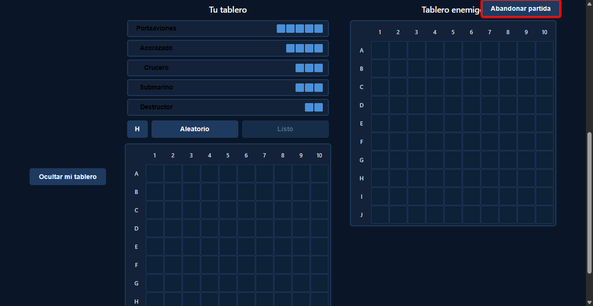
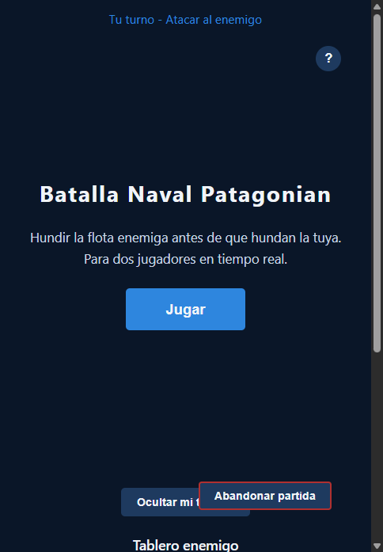
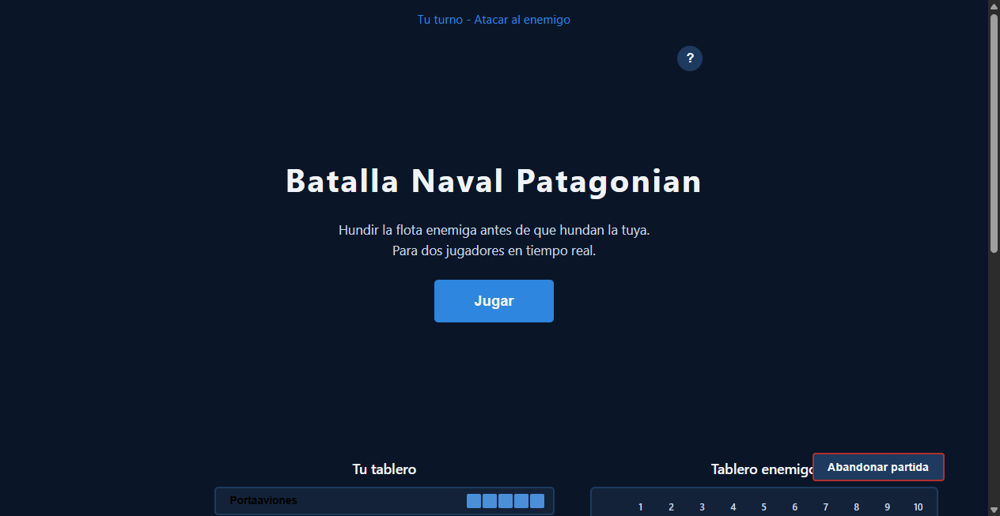

# Bug Fix: Botón Abandonar Ocupa Demasiado Espacio en el Layout

**ADW ID:** cl00i4s
**Fecha:** 2026-02-26
**Especificación:** specs/bug-51-boton-abandonar-layout-grande.md

## Resumen

El botón "Abandonar partida" (`#btn-abandon`) aparecía con un tamaño excesivo dentro del flex container `#game-container`, rompiendo el layout de los tableros durante la fase de colocación y combate. Se corrigió extrayéndolo del flujo flex mediante `position: absolute`, anclándolo en la esquina superior derecha del contenedor sin afectar a los demás elementos del layout.

## Screenshots

## Lo Construido

- Corrección de posicionamiento CSS para `#btn-abandon`: sacado del flujo flex con `position: absolute`
- Adición de `position: relative` a `#game-container` como contexto de posicionamiento
- Estilos hover para el botón (fondo rojo al pasar el cursor)
- Layout de tableros y paneles no afectado por el cambio

## Implementación Técnica

### Archivos Modificados

- `css/styles.css`: Únicos cambios relevantes al bug; el resto del diff pertenece a features anteriores ya en main

### Cambios Clave

- **`#game-container`**: Se agregó `position: relative` para establecer el contexto de posicionamiento del botón
- **`#btn-abandon`**: Se reemplazó el comportamiento flex item por `position: absolute; top: 0.5rem; right: 0.5rem`, extrayéndolo del flujo sin afectar el resto del layout
- **`#btn-abandon:hover`**: Se agregaron estilos de hover con fondo rojo (`#b03030`) y texto blanco para feedback visual

## Cómo Usar

1. Iniciar una partida con dos jugadores en `http://localhost:8000`
2. Durante la fase de colocación o combate, observar el botón "Abandonar partida" en la **esquina superior derecha** del game-container
3. El botón es compacto y no desplaza ni distorsiona el layout de los tableros
4. Al hacer clic, aparece un diálogo de confirmación; confirmar abandona la partida, cancelar la mantiene activa

## Configuración

No requiere configuración adicional. El cambio es puramente CSS.

## Pruebas

1. Iniciar servidor: `python -m http.server 8000`
2. Abrir dos pestañas, crear sala en una y unirse en la otra
3. En fase de colocación: verificar que `#btn-abandon` aparece en la esquina superior derecha, compacto
4. En fase de combate: verificar que el botón no desplaza los tableros
5. En mobile (viewport < 900px): verificar que el botón sigue posicionado correctamente sin tapar contenido
6. Inspeccionar con DevTools: `#btn-abandon` debe tener `position: absolute`, `top: 0.5rem`, `right: 0.5rem`
7. Verificar que `#btn-toggle-board` sigue funcionando (ocultar/mostrar tablero propio en mobile)

## Notas

- La causa raíz era la ausencia de `align-self` en `#btn-abandon`: el valor por defecto `stretch` lo estiraba verticalmente como elemento flex, y al no tener restricción de ancho ocupaba su propia fila en el layout wrap.
- El selector hermano CSS `#btn-toggle-board:not([hidden]) ~ #player-column` (mobile) no se vio afectado porque el cambio es solo en CSS, no en la estructura HTML.
- `#btn-toggle-board` ya tenía `align-self: center` y funcionaba correctamente; no requirió cambios.
