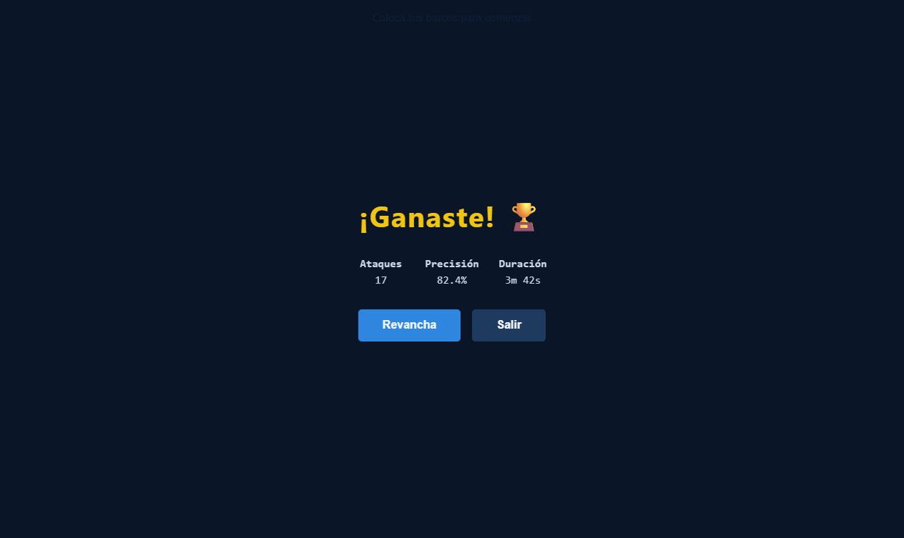
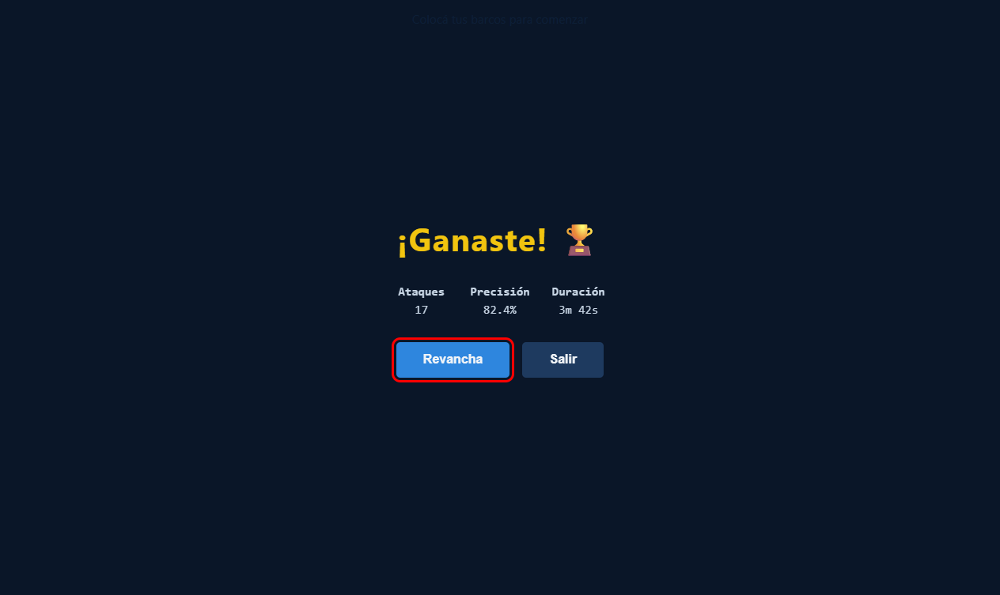
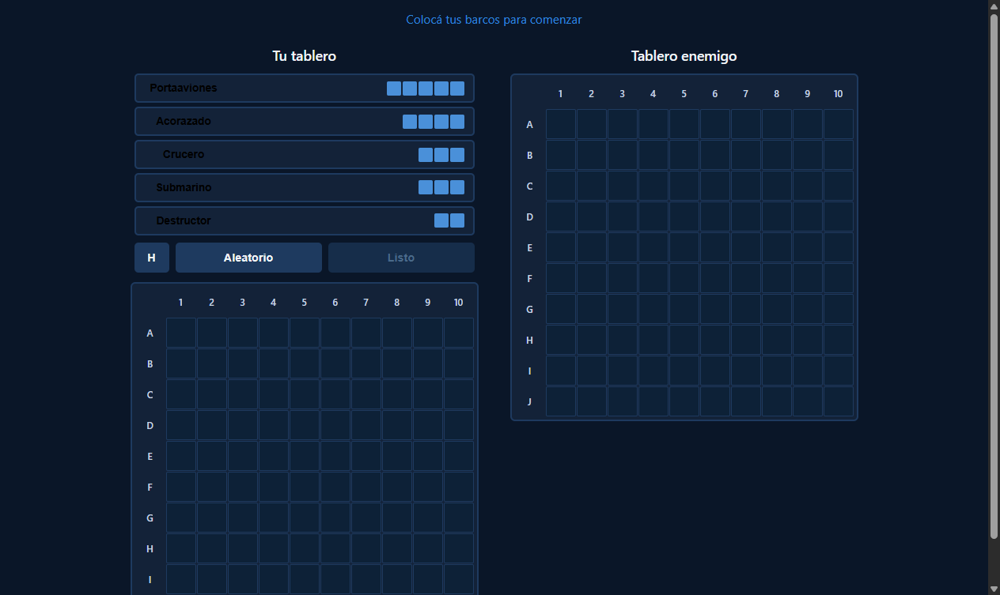

# Bug Fix: Botón Revancha Reinicia La Partida Correctamente

**ADW ID:** 45qho73
**Fecha:** 2026-02-26
**Especificación:** specs/bug-42-revancha-no-reinicia-partida.md

## Resumen

Se corrigió el bug donde el botón "Revancha" al finalizar una partida ejecutaba `window.location.reload()` — idéntico al botón "Salir" — desconectando a ambos jugadores de su sala compartida. Ahora el botón reinicia el estado de la sala en Firebase y ambos clientes transicionan automáticamente a la fase de colocación de barcos sin recargar la página.

## Screenshots

## Lo Construido

- Función `resetRoom(roomId)` en `firebase-game.js` que limpia el estado de la sala en Firebase
- Detección de transición `"finished"` → `"placing"` en `listenRoom` para reiniciar el estado interno del listener
- Función `handleReturnToPlacing()` en `game.js` que transiciona ambos clientes a la fase de colocación limpiando el DOM
- Callback `onStatusChange` funcional que detecta cuando la sala vuelve a `"placing"` durante la pantalla de fin
- Uso de `{ once: true }` en los handlers de `btnRematch` y `btnExit` para evitar acumulación de listeners

## Implementación Técnica

### Archivos Modificados

- `js/firebase-game.js`: Agregada `resetRoom()` y lógica de reset interno en `listenRoom`
- `js/game.js`: Reemplazado handler de `btnRematch`, agregada `handleReturnToPlacing()`, actualizado `onStatusChange`

### Cambios Clave

- **`resetRoom(roomId)`**: Usa `update()` con operaciones atómicas para resetear `status → "placing"`, `attacks → null`, `winner → null`, `currentTurn → null`, `player1/ready → false`, `player2/ready → false`, y `ships → null` para ambos jugadores

- **Reset en `listenRoom`**: Cuando `_gameFinished === true` y el nuevo status es `"placing"`, se reinician las variables internas `_gameFinished`, `_lastTurn` y `_lastAttacksLen` para que los callbacks de turno y ataques funcionen correctamente en la segunda partida

- **`handleReturnToPlacing()`**: Resetea estado interno (`fleetState`, `_isMyTurn`, `_prevEnemySunkIds`), oculta la pantalla de fin, muestra la fase de colocación, limpia clases CSS de combate en ambos tableros, llama a `Placement.clearAllPlacements()` y resetea el botón toggle — sin rellamar `bindEvents()` para evitar listeners duplicados

- **`onStatusChange` con guard**: El callback solo ejecuta `handleReturnToPlacing()` si `endScreen` existe y no está oculto, diferenciando la transición inicial `"waiting"` → `"placing"` (cuando player2 se une) de la transición de revancha

- **`{ once: true }`**: Aplicado a ambos `btnRematch` y `btnExit` para prevenir acumulación de event listeners en partidas múltiples seguidas

## Cómo Usar

1. Dos jugadores completan una partida normalmente
2. En la pantalla de fin, cualquiera de los dos jugadores presiona **"Revancha"**
3. El estado de la sala se resetea automáticamente en Firebase
4. Ambos clientes (quien presionó y su oponente) transicionan a la fase de colocación de barcos
5. Ambos jugadores colocan sus barcos y presionan "Listo" para iniciar la segunda partida

## Pruebas

1. Abrir `http://localhost:8000` en dos pestañas/ventanas del navegador
2. Crear sala en una pestaña y unirse con el código en la otra
3. Completar una partida (colocación → combate hasta victoria)
4. Presionar "Revancha" desde la pantalla de fin
5. Verificar que ambas pestañas transicionan a la fase de colocación sin recargar la página
6. Verificar que los tableros están limpios (sin marcas de la partida anterior)
7. Completar una segunda partida completa incluyendo nueva pantalla de fin
8. Verificar que el botón "Salir" sigue recargando la página normalmente

## Notas

- Si solo un jugador presiona "Revancha" y el otro ya salió, la sala queda en estado `"placing"` sin consecuencias — es una sala huérfana sin oponente activo
- La función `handleReturnToPlacing()` limpia el DOM directamente en lugar de llamar `Placement.init()` para evitar el problema de listeners duplicados: `bindEvents()` agrega listeners a `btn-orientation`, `btn-random` y `.ship-item` que persisten entre partidas
- El cambio de clase CSS de `--showing-own` a `--hiding-own` en el botón toggle (incluido en este branch) refleja el nuevo comportamiento: en mobile el tablero propio empieza oculto y el botón invita a mostrarlo
