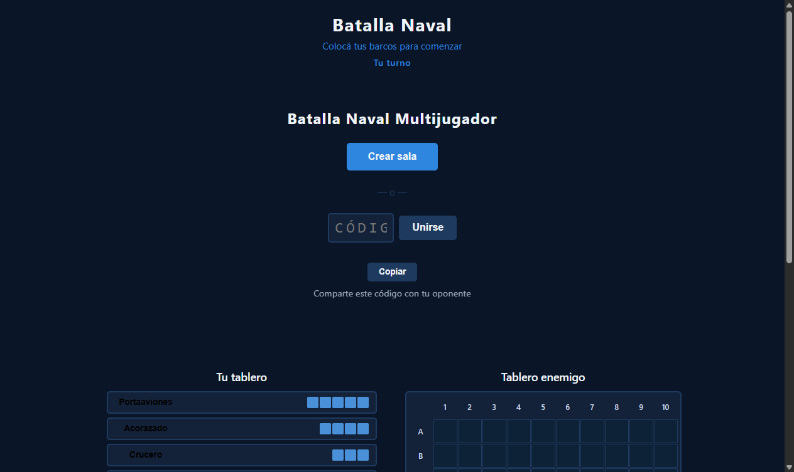
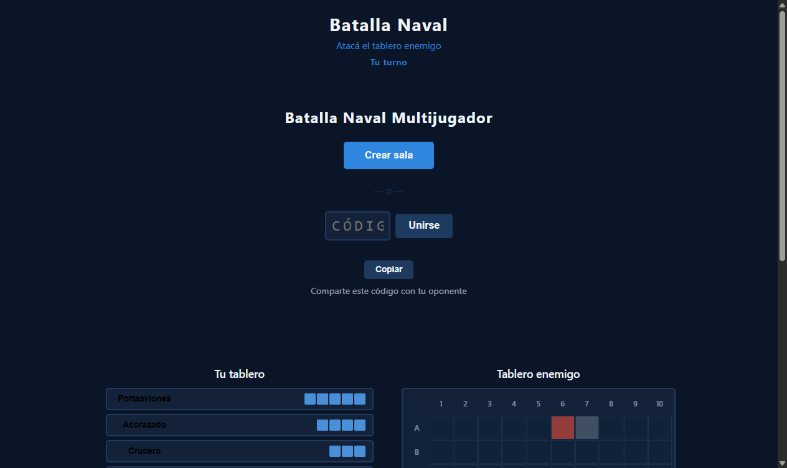

# Sincronización de Estado en Tiempo Real

**ADW ID:** 4b096cz
**Fecha:** 2026-02-20
**Especificación:** specs/feature-010-sincronizacion-estado-tiempo-real.md

## Resumen

Se implementó la sincronización bidireccional en tiempo real entre los dos clientes del juego usando Firebase Realtime Database. Cuando un jugador presiona "Listo", su flota se escribe en Firebase; cuando ambos están listos, la partida arranca automáticamente y los turnos de ataque se alternan con feedback inmediato en menos de 1 segundo.

## Screenshots

## Lo Construido

- `syncReadyState(roomId, playerKey, ships)` — escribe la flota y el flag `ready` del jugador local en Firebase
- `listenRoom()` extendido — detecta `onBothReady`, `onTurnChange` y `onAttacksChange` con estado local para evitar disparos redundantes
- `registerAttack(roomId, playerKey, cellId, result)` — registra un ataque en Firebase via `push()`
- `startGame(roomId)` — solo `player1` escribe `status: "playing"` y `currentTurn: "player1"` para evitar race conditions
- `setTurn(roomId, nextTurn)` — alterna el turno en Firebase tras cada ataque
- `getRoomData()` — expone el último snapshot de Firebase para consulta local
- `#turn-indicator` — elemento HTML con ARIA que muestra "Tu turno" / "Turno del oponente" en tiempo real
- Estilos CSS de combate — clases para hits/misses en tablero propio y enemigo, estado `board--disabled`
- Listener de clics en `#enemy-board` — determina hit/miss, da feedback inmediato y escribe en Firebase
- `handleBothReady`, `handleTurnChange`, `handleAttacksChange` — handlers en `game.js` que conectan Firebase con el DOM

## Implementación Técnica

### Archivos Modificados

- `js/firebase-game.js`: añadidas funciones `syncReadyState`, `startGame`, `registerAttack`, `setTurn`, `getRoomData`; extendido `listenRoom()` con los tres nuevos callbacks; `push` añadido al import del SDK; exportado todo en `FirebaseGame`
- `js/game.js`: extendido `onReady()` para llamar a Firebase; añadidos `handleBothReady`, `handleTurnChange`, `handleAttacksChange`; añadido listener de clics en `#enemy-board` para el combate
- `index.html`: añadido `

` en el header
- `css/styles.css`: añadidas custom properties de color (`--color-hit`, `--color-miss`, `--color-hit-received`, `--color-miss-received`) y reglas para `#turn-indicator`, `.cell--attacked--hit/miss`, `.cell--hit-received/miss-received`, `#enemy-board.board--disabled`

### Cambios Clave

- **Race condition mitigada**: solo `player1` escribe el estado inicial de la partida (`status: "playing"`, `currentTurn: "player1"`)
- **`attacks` como objeto en Firebase**: `push()` genera claves tipo `-OPqrs…`; se usa `Object.values(data.attacks || {})` consistentemente para convertir a array
- **Estado local en `listenRoom`**: variables `_lastTurn` y `_lastAttacksLen` evitan disparar callbacks redundantes en cada snapshot de Firebase
- **Feedback inmediato**: la celda atacada se pinta localmente antes de esperar la confirmación de Firebase; el turno se deshabilita localmente al mismo tiempo
- **Acceso a flota del oponente**: `getRoomData()` expone el último snapshot para determinar hit/miss en el click handler del tablero enemigo

## Cómo Usar

1. Abrir el juego en dos pestañas (`http://localhost:8000`)
2. Pestaña A: crear sala → copiar código de 6 caracteres
3. Pestaña B: ingresar código → unirse a la sala
4. Ambas pestañas: colocar los 5 barcos (manual o aleatorio) → presionar "Listo"
5. Ambas UIs muestran "¡La partida comenzó!" automáticamente; `player1` puede atacar primero
6. Hacer clic en una celda del tablero enemigo → feedback inmediato → turno pasa al oponente
7. Los ataques recibidos aparecen en el tablero propio en rojo (hit) o gris (miss)

## Configuración

- Firebase Realtime Database ya configurado en `js/firebase-config.js` (en `.gitignore`)
- No se requiere ninguna configuración adicional; el SDK v10.7.1 se carga via CDN

## Pruebas

1. Abrir `http://localhost:8000` en dos pestañas (requiere servidor: `python -m http.server 8000`)
2. Verificar en Firebase Console que tras presionar "Listo": `player{N}/ready: true` y `player{N}/ships: {...}` aparecen en menos de 2 segundos
3. Verificar que `status` cambia a `"playing"` exactamente una vez y `currentTurn: "player1"`
4. Hacer clic en el tablero enemigo en pestaña A → verificar ataque en Firebase → verificar celda pintada en pestaña B
5. Verificar que `#turn-indicator` muestra el texto correcto y el tablero enemigo queda deshabilitado fuera de turno
6. DevTools → Console: cero errores JS durante todo el flujo

## Notas

- **Condición de victoria**: fuera del alcance de esta feature; se implementará en una issue posterior
- **`onDisconnect`**: no implementado; si un jugador cierra la pestaña durante el combate, la sala queda en estado inconsistente (mejora futura)
- **`prefers-reduced-motion`**: cubierto; `#turn-indicator` incluido en la media query que elimina transiciones
- **Accesibilidad**: `#turn-indicator` usa `role="status"` y `aria-live="polite"` para lectores de pantalla
