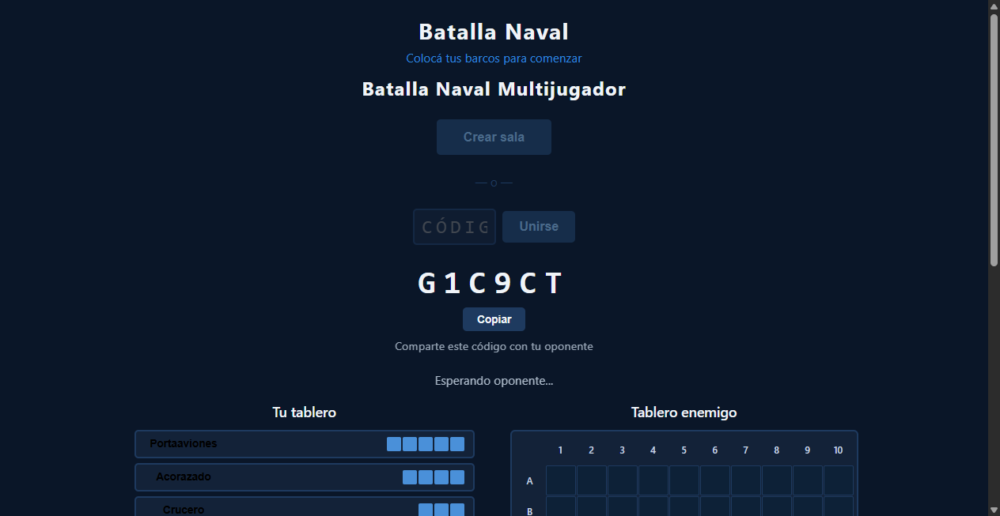
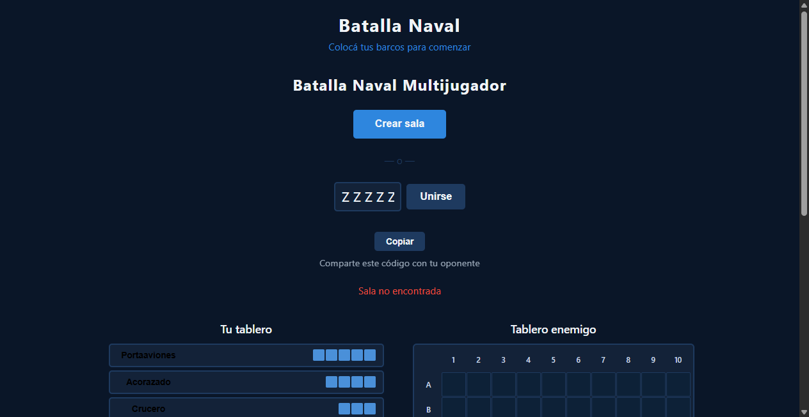

# Integración Firebase — Sistema de Salas (Lobby)

**ADW ID:** 63cvk48
**Fecha:** 2026-02-20
**Especificación:** specs/feature-006-integracion-firebase-sistema-salas.md

## Resumen

Se implementó el sistema de lobby multiplayer que permite a dos jugadores conectarse a una sala compartida antes de comenzar la partida. El primer jugador crea una sala con un código de 6 caracteres alfanuméricos y espera; el segundo jugador ingresa el código y se une. Cuando ambos están conectados, Firebase sincroniza el estado y ambas pestañas transicionan automáticamente a la fase de colocación de barcos.

## Screenshots

### Pantalla inicial del lobby

### Sala creada — esperando oponente

### Error: código inválido

### Player 2 se une — transición al juego

### Player 1 — transición automática al juego

## Lo Construido

- Pantalla de lobby (`#lobby`) con flujo crear sala y unirse a sala
- Módulo `js/firebase-game.js` con toda la lógica Firebase del lobby
- Integración de la pantalla de lobby con `js/game.js`
- Estilos CSS para el lobby (responsive, accesible, coherente con la paleta existente)
- Conversión de scripts a módulos ES6 (`type="module"`)

## Implementación Técnica

### Archivos Modificados

- `index.html`: agregada sección `#lobby` antes de `#game-container`; `#game-container` arranca con `hidden`; scripts convertidos a `type="module"`
- `css/styles.css`: 151 líneas de estilos nuevos para lobby (layout, input de código, botón copiar, estados de error)
- `js/game.js`: importa `FirebaseGame`; genera `playerId`; listeners para crear sala, unirse y copiar código; función `handleBothConnected` para transición de pantallas; expone `roomId`, `playerKey` y `playerId` en `window.Game`
- `js/placement.js`: `Placement` expuesto como `window.Placement` para compatibilidad con módulos ES6

### Archivos Nuevos

- `js/firebase-game.js`: módulo ES6 con `createRoom`, `joinRoom`, `listenRoom`, `destroy` y `generateRoomId`

### Cambios Clave

- `generateRoomId()` produce códigos de 6 caracteres de `A-Z0-9`
- `createRoom(playerId)` escribe `rooms/{roomId}` en Firebase con `status: "waiting"` y `player1.id`
- `joinRoom(roomId, playerId)` valida existencia, estado y disponibilidad de la sala antes de escribir `player2.id` y cambiar `status` a `"placing"`
- `listenRoom(roomId, callbacks)` usa `onValue` de Firebase para detectar cuando `player2` se une y llama `onPlayerJoined`
- `window.Game.roomId` y `window.Game.playerKey` quedan disponibles para las fases posteriores (colocación, combate)
- Fallback de `playerId`: `crypto.randomUUID()` si disponible, sino `Math.random().toString(36).slice(2)`

## Cómo Usar

1. Servir el proyecto con `python -m http.server 8000` (requerido para módulos ES6)
2. Abrir `http://localhost:8000` en una pestaña — se muestra el lobby
3. Click en **Crear sala** → aparece el código de 6 chars y el mensaje "Esperando oponente..."
4. Abrir `http://localhost:8000` en una segunda pestaña → ingresar el código → click **Unirse**
5. Ambas pestañas transicionan automáticamente a la fase de colocación de barcos

## Configuración

- `js/firebase-config.js` debe existir localmente con las credenciales reales (está en `.gitignore`). Copiar de `firebase-config.example.js` y completar.
- La página **debe** servirse desde HTTP (no `file://`) para que funcionen los módulos ES6 y Firebase.

## Pruebas

- **Crear sala**: click "Crear sala" → verificar código en pantalla y estructura `rooms/{roomId}` en Firebase Console
- **Unirse con código válido**: ingresar código en otra pestaña → ambas pestañas muestran `#game-container`
- **Código inválido**: ingresar código inexistente → mensaje "Sala no encontrada" en `#lobby-status`
- **Sala llena**: intentar unirse a sala con `player2` ya asignado → mensaje "La sala ya está completa"
- **Flujo completo**: lobby → colocación → sin regresiones en el flujo de colocación existente
- **DevTools → Console**: cero errores JS durante todo el flujo
- **DevTools → Network → WS**: una sola conexión Firebase activa por pestaña

## Notas

- Esta feature es prerequisito de `feature-004-sincronizacion-firebase` (combate en tiempo real), que asume `rooms/{roomId}` con `player1.id` y `player2.id` ya asignados.
- No se implementa Firebase Auth; se usa un UUID anónimo como `playerId` para mantener la simplicidad.
- Colisiones de `roomId` son estadísticamente improbables (36^6 ≈ 2.1B combinaciones); reintento automático queda como mejora futura.
- El listener de player1 queda huérfano en Firebase si cierra la pestaña durante la espera; `onDisconnect` es mejora futura.
