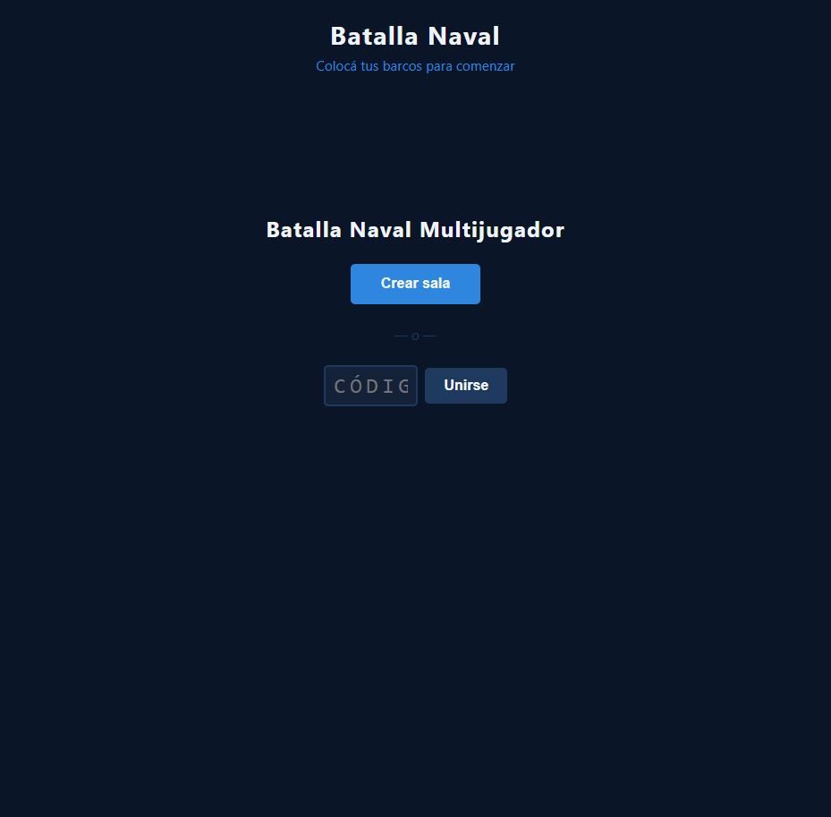

# Detección de Condición de Victoria y Fin de Partida

**ADW ID:** dnr0smc
**Fecha:** 2026-02-20
**Especificación:** specs/feature-0014-deteccion-condicion-victoria.md

## Resumen

Se implementó la detección automática de victoria al final de cada ataque: cuando un jugador hunde el último barco del oponente, el estado de la sala pasa a `finished` en Firebase y ambos jugadores ven simultáneamente una pantalla de fin de partida con el resultado, estadísticas personales y opciones de revancha o salida.

## Screenshots

## Lo Construido

- Función pura `checkVictoryCondition` para evaluar si todos los barcos enemigos fueron hundidos
- Método `FirebaseGame.setWinner()` que escribe `winner` y `status: 'finished'` atómicamente en Firebase
- Callback `onGameFinished` en `listenRoom` con flag anti-duplicado `_gameFinished`
- Sección `#end-screen` en HTML con resultado, estadísticas (ataques, precisión, duración) y botones
- Estilos CSS para la pantalla de fin: overlay fijo, colores dorado/rojo según resultado, grid de stats, responsive mobile

## Implementación Técnica

### Archivos Modificados

- `js/game.js`: función `checkVictoryCondition`, integración en handler de ataque, `handleGameFinished` con cálculo de stats y manejo de botones
- `js/firebase-game.js`: función `setWinner`, extensión de `listenRoom` con callback `onGameFinished` y flag `_gameFinished`
- `index.html`: sección `#end-screen` con `[hidden]`, stats spans y botones de revancha/salida
- `css/styles.css`: estilos del overlay, clases `--win`/`--lose`, grid de estadísticas, media query ≤600px

### Cambios Clave

- **Detección de victoria**: después de cada hit, se recuperan los ataques del jugador desde `_roomData`, se normalizan las celdas (removiendo prefijo `cell-`) y se compara contra los barcos del oponente con `checkVictoryCondition`
- **Escritura atómica**: `setWinner` usa `update()` del SDK v9 para escribir `winner` y `status` en un solo round-trip a Firebase
- **Disparo único del evento**: el flag `_gameFinished` en `firebase-game.js` garantiza que `onGameFinished` se llame solo una vez aunque el listener de Firebase dispare múltiples veces
- **Stats calculadas localmente**: ataques totales, precisión y duración se calculan en el cliente desde `_roomData.attacks` sin queries adicionales a Firebase
- **Reconexión compatible**: cualquier cliente que se conecte con la sala en estado `finished` recibirá el snapshot inmediatamente y mostrará la pantalla de fin de partida

## Cómo Usar

1. Crear o unirse a una sala desde el lobby
2. Ambos jugadores colocan sus barcos y confirman listos
3. Jugar en turnos atacando el tablero enemigo
4. Cuando el último barco enemigo es hundido, la pantalla `#end-screen` aparece automáticamente en ambos clientes
5. El ganador ve "¡Ganaste! 🏆" en dorado; el perdedor ve "Perdiste... 💀" en rojo
6. Las estadísticas muestran ataques totales realizados, precisión (%) y duración de la partida
7. Botón **Revancha**: recarga la página para iniciar una nueva partida
8. Botón **Salir**: recarga la página y regresa al lobby

## Configuración

No requiere configuración adicional. Utiliza la misma instancia Firebase configurada en `js/firebase-config.js`. La función `update` del SDK Firebase v9 ya estaba importada en `firebase-game.js`.

## Pruebas

1. Iniciar servidor: `python -m http.server 8000`
2. Abrir dos pestañas/navegadores en `http://localhost:8000`
3. Crear sala en una pestaña, unirse con el código en la otra
4. Colocar barcos en ambas pestañas y confirmar listos
5. Atacar turnos alternados hasta hundir todos los barcos de un jugador
6. Verificar que `#end-screen` aparece en ambos clientes con el resultado correcto
7. Verificar en Firebase Realtime Database Console: `rooms/{roomId}/status === "finished"` y `winner` establecido
8. Probar reconexión: cerrar y reabrir una pestaña con la URL de la sala activa en estado `finished`

## Notas

- El botón "Revancha" en esta versión realiza `window.location.reload()` al igual que "Salir"; una revancha real en sala compartida (sin cambiar URL) requeriría resetear el estado Firebase y es una mejora futura
- La función `checkVictoryCondition` es pura y no accede a Firebase, lo que facilita futuros tests unitarios
- No se implementó indicador visual de "barco hundido" por barco individual; eso queda como mejora futura independiente
- La normalización de celdas (`cell-A1` → `A1`) es necesaria porque los ataques se almacenan sin el prefijo pero los ships se registran con el prefijo completo
