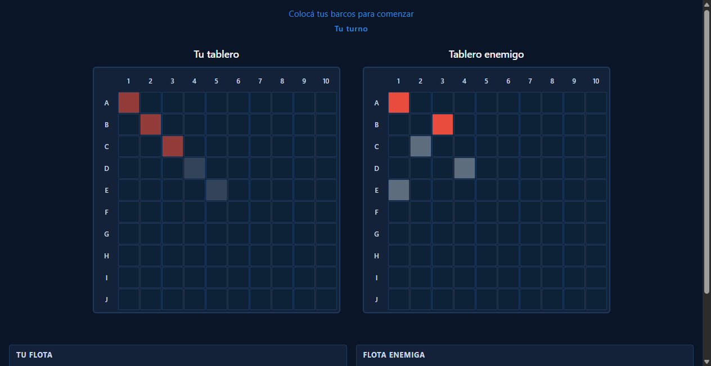
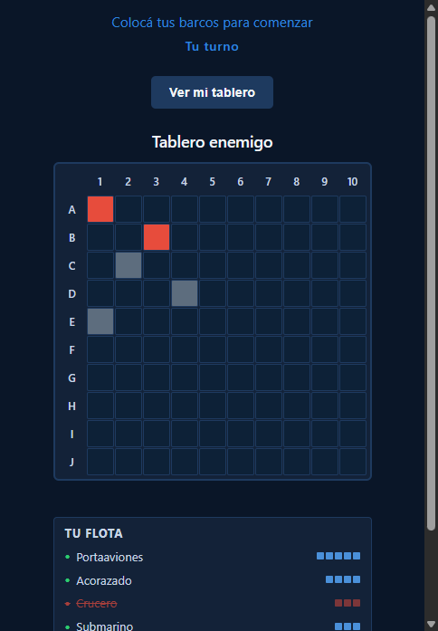
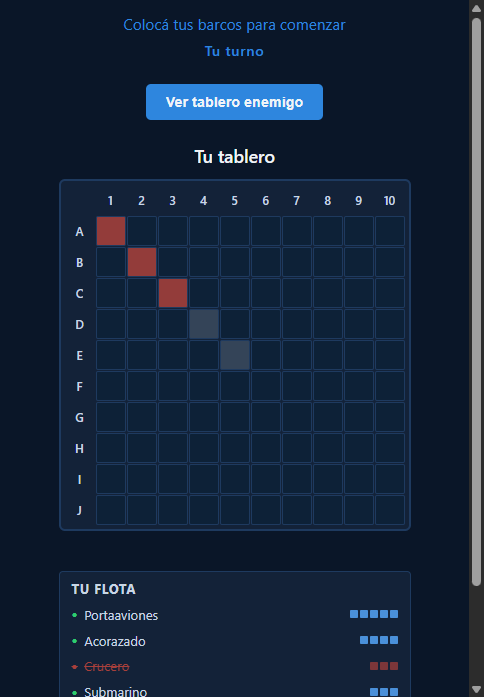

# Toggle Tablero Propio Durante el Combate

**ADW ID:** feltfoc
**Fecha:** 2026-02-26
**Especificación:** specs/feature-39-toggle-tablero-propio.md

## Resumen

Se añadió un botón de toggle que permite al jugador alternar entre ver su tablero propio y el tablero enemigo durante la fase de combate en dispositivos móviles. En pantallas pequeñas (≤900px) los dos tableros se apilaban verticalmente obligando al jugador a hacer scroll; ahora el jugador puede cambiar de vista con un solo clic, mejorando significativamente la experiencia en móvil.

## Screenshots

### Desktop: ambos tableros visibles simultáneamente

### Mobile (default): solo tablero enemigo visible

### Mobile: toggle activado, tablero propio visible

### Mobile: volver a vista enemigo

### Mobile: estado activo del botón

## Lo Construido

- Botón `#btn-toggle-board` en el HTML con soporte completo de accesibilidad (`aria-pressed`, `aria-label`)
- Estilos CSS para el botón (consistentes con la paleta existente) y reglas de visibilidad de columnas en mobile
- Lógica JS para revelar el botón al inicio del combate, manejar el toggle de clase `--showing-own` y actualizar texto/atributos del botón
- Reset automático del estado del toggle al finalizar la partida

## Implementación Técnica

### Archivos Modificados

- `index.html`: Añadido `<button id="btn-toggle-board">` dentro de `#game-container`, con `hidden` por defecto
- `css/styles.css`: Estilos del botón toggle y reglas de visibilidad de columnas dentro del breakpoint `@media (max-width: 900px)`
- `js/game.js`: Lógica de activación del botón en `handleTurnChange` y reset en `handleGameFinished`

### Cambios Clave

- El ocultamiento de columnas se maneja puramente con CSS mediante la clase `--showing-own` sobre `#game-container`, sin lógica extra en JS
- La regla de ocultamiento por defecto en mobile usa el selector hermano `#btn-toggle-board:not([hidden]) ~ #player-column` para activarse solo durante el combate (cuando el botón es visible), sin afectar la fase de colocación
- El listener del toggle se registra una sola vez usando `toggleBtn.hidden` como guardia, evitando listeners duplicados
- En desktop (>900px) el botón permanece oculto (`display: none`) y ambos tableros son siempre visibles
- La clase `board--disabled` del tablero enemigo se preserva correctamente independientemente del estado del toggle

## Cómo Usar

1. Iniciar una partida y llegar a la fase de combate
2. En un viewport móvil (≤900px), el botón **"Ver mi tablero"** aparece en la parte superior del área de juego
3. Por defecto solo se muestra el tablero enemigo
4. Hacer clic en **"Ver mi tablero"** → el tablero propio aparece y el enemigo se oculta; el botón cambia a "Ver tablero enemigo"
5. Hacer clic en **"Ver tablero enemigo"** → se vuelve a la vista del tablero enemigo
6. En desktop (>900px) ambos tableros son visibles simultáneamente y el botón no aparece

## Configuración

No requiere configuración adicional. El comportamiento es responsive y se activa automáticamente en viewports ≤900px.

## Pruebas

1. Iniciar servidor: `python -m http.server 8000`
2. Abrir dos pestañas en `http://localhost:8000`
3. Crear sala en pestaña A, unirse en pestaña B
4. Colocar todos los barcos y presionar "Listo" en ambas pestañas
5. En **DevTools con viewport < 900px**:
   - Verificar que aparece el botón "Ver mi tablero" al iniciar el combate
   - Verificar que por defecto solo se muestra el tablero enemigo
   - Alternar con el botón y verificar cambios de texto y visibilidad
6. En **viewport > 900px**: verificar que el botón no aparece y ambos tableros son visibles
7. Terminar la partida: verificar que el botón desaparece y el estado se resetea

## Notas

- No se modifica `firebase-game.js` ya que el toggle es puramente local y no afecta el estado compartido entre jugadores
- El botón usa la misma paleta de colores que los botones existentes (`--color-btn-bg`, `--color-primary`, etc.) para mantener consistencia visual
- `aria-label` describe la acción al hacer clic (no el estado actual), siguiendo las convenciones de accesibilidad para botones toggle
