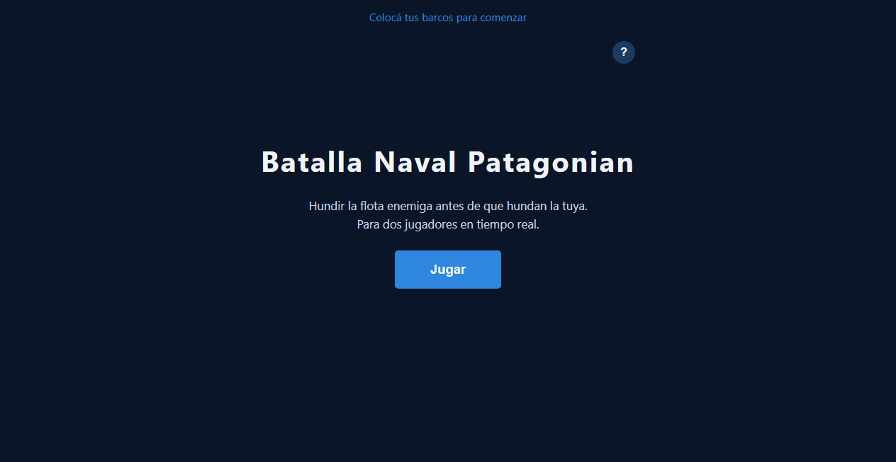
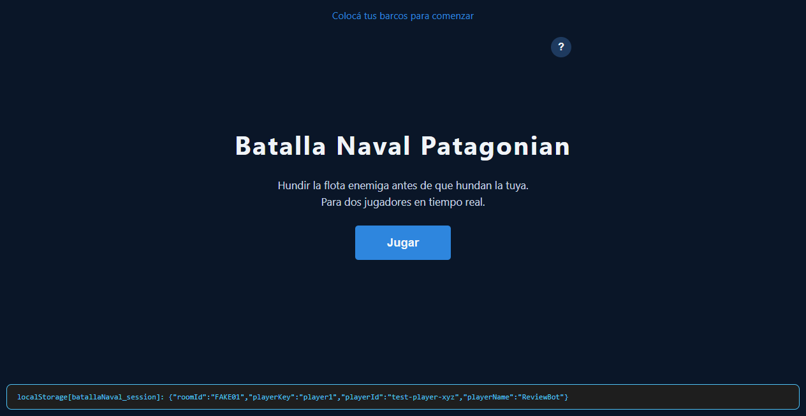
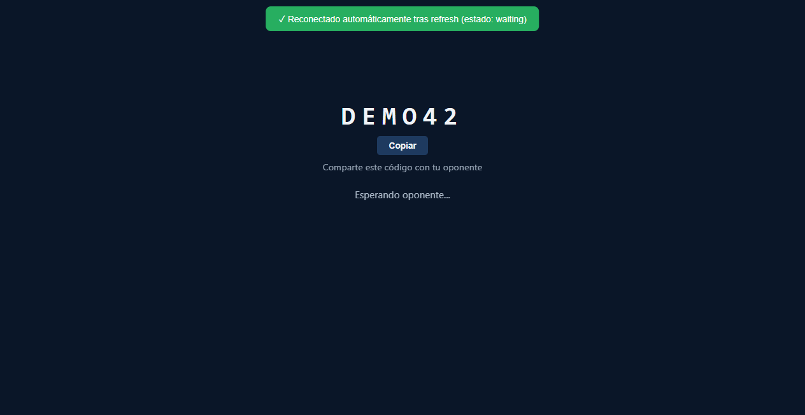
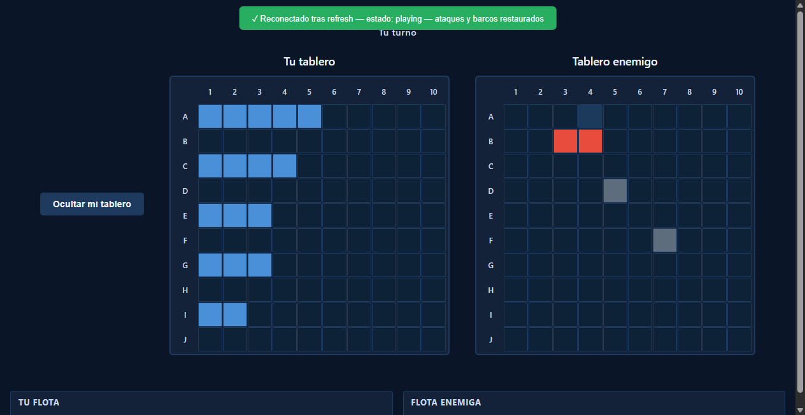
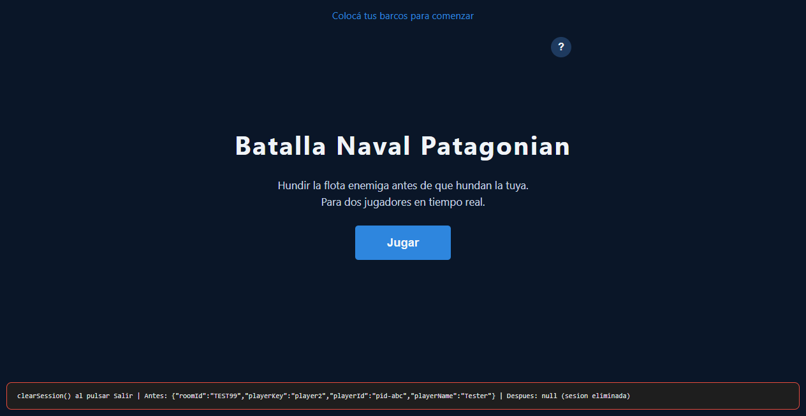

# Persistir Sesión del Juego y Reconectar tras Refresh

**ADW ID:** ghq5znt
**Fecha:** 2026-02-26
**Especificación:** specs/feature-45-persistir-sesion-juego-reconectar-refresh.md

## Resumen

Implementa persistencia de sesión mediante `localStorage` para que los jugadores puedan reconectarse automáticamente a su partida tras recargar el navegador. Al crear o unirse a una sala se guarda la identidad del jugador (`roomId`, `playerKey`, `playerId`, `playerName`), y al cargar la página se detecta esa sesión, se valida contra Firebase y se restaura la UI según la fase actual del juego.

## Screenshots

## Lo Construido

- Módulo `js/session.js` con API de persistencia (`saveSession`, `loadSession`, `clearSession`)
- Función `reconnectRoom(roomId, playerId)` en Firebase que valida la identidad del jugador
- Lógica de reconexión automática en `DOMContentLoaded` (game.js)
- Función `restoreGamePhase(data)` que restaura la UI según el status de la sala
- Guardado de sesión al crear o unirse a sala
- Limpieza de sesión al hacer clic en "Salir"

## Implementación Técnica

### Archivos Modificados

- `js/session.js` *(nuevo)*: módulo con `saveSession()`, `loadSession()` y `clearSession()` encapsulando `localStorage` con key `'batallaNaval_session'`
- `js/firebase-game.js`: agrega `reconnectRoom(roomId, playerId)` que hace `get` de la sala, identifica el `playerKey` según el `playerId` y retorna `{ roomId, playerKey, data }`; también agrega `resetRoom()` para revancha
- `js/game.js`: importa `session.js`, guarda sesión tras crear/unirse, limpia al salir, implementa reconexión asíncrona en `DOMContentLoaded` y la función `restoreGamePhase(data)` con árbol de decisión por status

### Cambios Clave

- `DOMContentLoaded` se convierte en `async` para poder usar `await` en la reconexión
- `restoreGamePhase(data)` cubre los cuatro estados: `waiting`, `placing` (ready=false), `placing` (ready=true), `playing`, `finished`
- Durante reconexión en `playing`: se restaura `fleetState`, se llama `Placement.renderShipsOnBoard()`, se reprocesan todos los ataques vía `handleAttacksChange()`, y se re-registra el listener de Firebase
- `window.Game.playerId` se sobreescribe con el valor guardado para mantener consistencia de identidad
- `try/catch` en la reconexión: si la sala no existe o el `playerId` no coincide, se llama `clearSession()` y se muestra la home screen sin error visible
- `js/placement.js`: agrega `renderShipsOnBoard(ships)` que aplica la clase `cell--ship` a las celdas a partir del mapa de barcos de Firebase

## Cómo Usar

1. Ingresar nombre y crear o unirse a una sala — la sesión se guarda automáticamente en `localStorage`
2. Recargar la pestaña del navegador en cualquier fase del juego
3. La página detecta la sesión guardada, muestra un spinner, valida contra Firebase y restaura la pantalla correcta:
   - **Lobby de espera**: vuelve al lobby con el código de sala visible
   - **Colocación (no listo)**: vuelve a la fase de colocación para re-colocar barcos
   - **Colocación (listo)**: vuelve al estado "esperando oponente" sin placement-phase
   - **Combate**: restaura tableros con todos los ataques, panel de flota y turno correcto
   - **Fin de juego**: muestra la end-screen con el resultado original
4. Hacer clic en "Salir" limpia la sesión; el siguiente reload lleva a la home screen sin reconexión

## Configuración

No requiere configuración adicional. El módulo usa `localStorage` nativo del navegador. Si `localStorage` no está disponible (modo privado extremo), los `try/catch` en `session.js` evitan crashes y la app funciona normalmente sin persistencia.

## Pruebas

**Verificar en DevTools → Application → Local Storage:**
- La clave `batallaNaval_session` aparece al crear o unirse a una sala
- Se elimina al hacer clic en "Salir"

**Escenarios de reconexión:**
1. Refresh en lobby de espera → debe mostrar el lobby con el código de sala
2. Refresh en colocación (antes de "Listo") → debe mostrar la fase de colocación
3. Refresh en colocación (después de "Listo") → debe mostrar "Esperando oponente..."
4. Refresh durante combate → todos los ataques deben estar marcados, turno correcto
5. Refresh en pantalla de fin → debe mostrar end-screen con resultado correcto
6. Salir y recargar → debe mostrar home screen sin reconexión
7. Sesión de sala expirada → debe mostrar home screen sin error visible

## Notas

- Los barcos no se persisten antes de hacer "Listo": si el jugador recarga antes de confirmar su colocación, debe re-colocarlos (sus barcos aún no estaban en Firebase)
- `playerId` local (generado en el closure de game.js) queda desincronizado al reconectar, pero `window.Game.playerId` (el que usan los handlers de Firebase) se sobreescribe correctamente con el valor guardado
- Mejora futura posible: agregar TTL de sesión para evitar reconectar a salas muy antiguas; por ahora Firebase lanza error si la sala no existe y se maneja limpiamente
