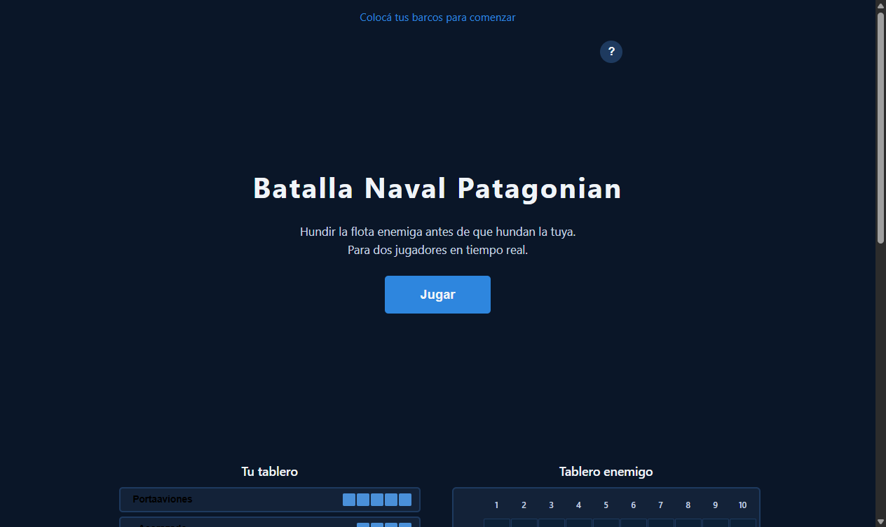
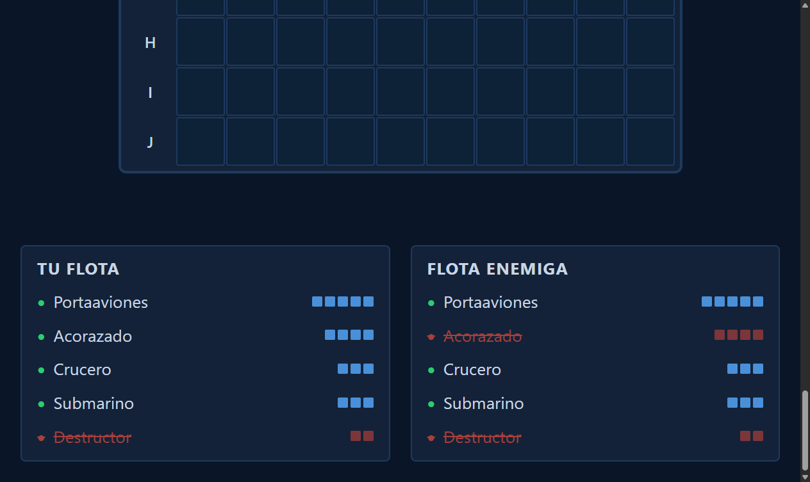
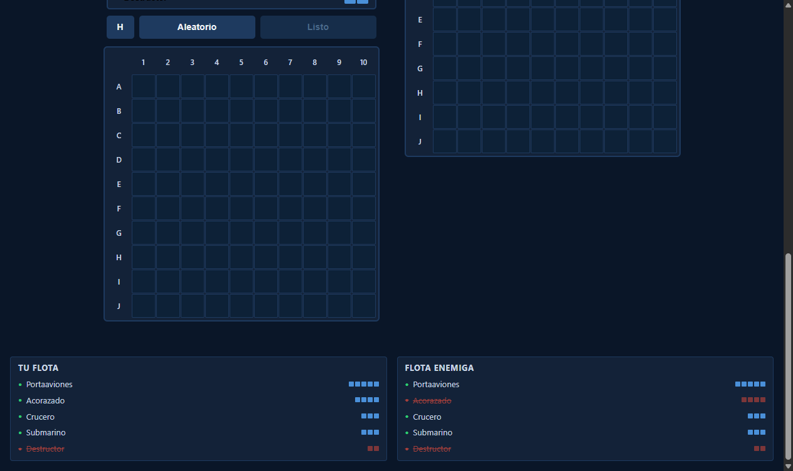

# Mostrar Tamaño de Barcos en el Panel de Flota

**ADW ID:** j6fkdz3
**Fecha:** 2026-02-26
**Especificación:** specs/feature-37-mostrar-tamano-barcos-panel-flota.md

## Resumen

Se añadió una indicación visual del tamaño de cada barco en el panel de flota durante la fase de combate. Cada ítem ahora muestra el nombre del barco junto a mini-bloques proporcionales a su número de celdas, y al hundir un barco los bloques cambian de azul a rojo acompañando el texto tachado.

## Screenshots

## Lo Construido

- Propiedad `size` agregada a cada barco en el array `SHIPS`
- Mini-bloques visuales (`fleet-item-block`) en cada ítem del panel de flota
- Estilos CSS para los bloques: azul cuando el barco está vivo, rojo cuando está hundido
- El panel "Tu Flota" y "Flota Enemiga" muestran ambos el mismo formato nombre + bloques

## Implementación Técnica

### Archivos Modificados

- `js/game.js`: agregada propiedad `size` al array `SHIPS` y modificada función `renderFleetPanel`
- `css/styles.css`: añadidos estilos para `.fleet-item-name`, `.fleet-item-blocks`, `.fleet-item-block` y estado hundido

### Cambios Clave

- **Array SHIPS**: cada objeto ahora incluye `size` con los valores estándar (carrier: 5, battleship: 4, cruiser/submarine: 3, destroyer: 2)
- **`renderFleetPanel`**: en vez de asignar `li.textContent`, construye dos `` hijos usando `createElement`/`appendChild`:
  - `` con el nombre
  - `` con `ship.size` elementos ``
- **CSS**: `.fleet-item-blocks` usa `margin-left: auto` para alinear los bloques a la derecha del ítem, aprovechando el `display: flex` existente en `.fleet-item`
- **Estado hundido**: `.fleet-item--sunk .fleet-item-block` cambia el fondo a `var(--color-hit)` con opacidad 0.7

## Cómo Usar

1. Iniciar servidor: `python -m http.server 8000`
2. Abrir dos pestañas en `http://localhost:8000`
3. Crear sala en pestaña A y unirse en pestaña B
4. Colocar barcos en ambas pestañas y presionar "Listo"
5. Durante el combate, verificar en el panel de flota que cada barco muestra su nombre + mini-bloques
6. Hundir un barco y observar que sus bloques cambian de azul a rojo

## Configuración

No requiere configuración adicional. Los cambios son puramente de UI/CSS en los archivos estáticos existentes.

## Pruebas

**Verificaciones manuales:**
- Panel "Tu Flota": 5 barcos con nombre + mini-bloques (5, 4, 3, 3, 2 bloques respectivamente)
- Panel "Flota Enemiga": mismo formato
- Al hundir un barco: bloques cambian a rojo junto al nombre tachado
- Sin desbordamiento en pantallas de 320px de ancho mínimo
- Múltiples llamadas a `renderFleetPanel` no duplican elementos (renderizado idempotente)

## Notas

- Los mini-bloques (8×8px) reutilizan el lenguaje visual de `.ship-cell-block` de la fase de colocación, reducidos para adaptarse al panel compacto.
- No se modifica `index.html` ya que el panel de flota se genera completamente por JS.
- Crucero y Submarino tienen ambos 3 bloques; los nombres los diferencian visualmente.
