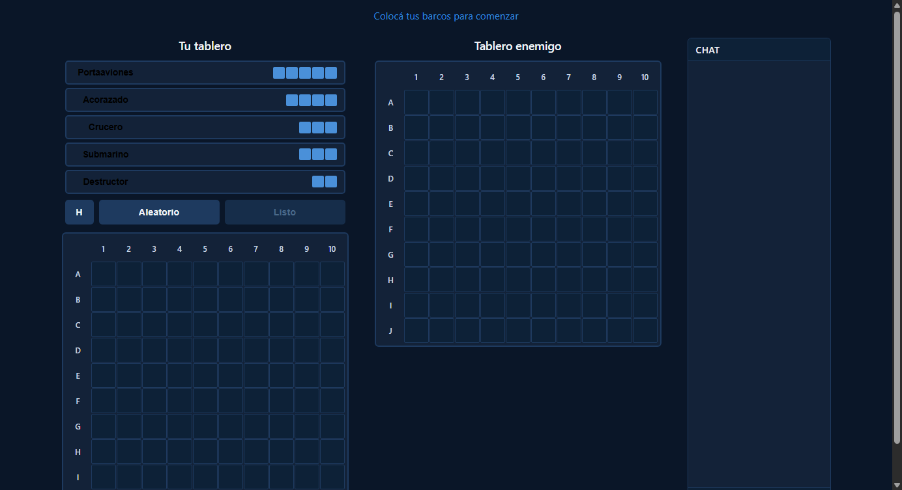
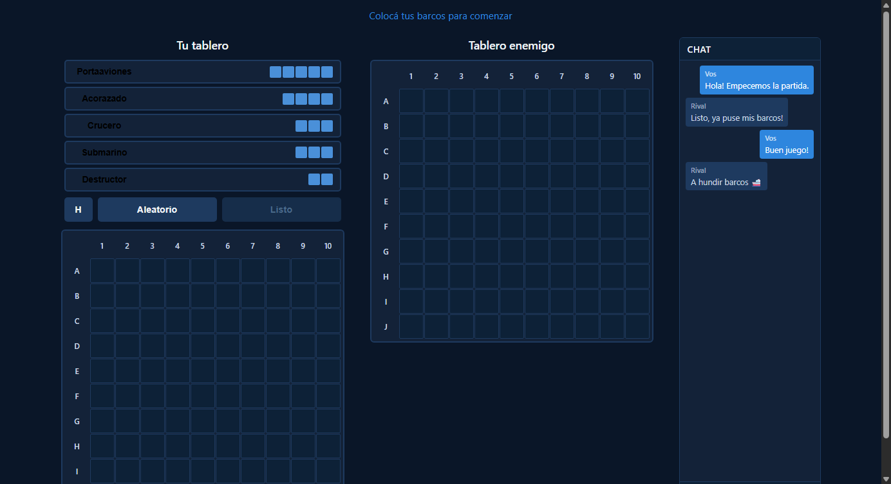
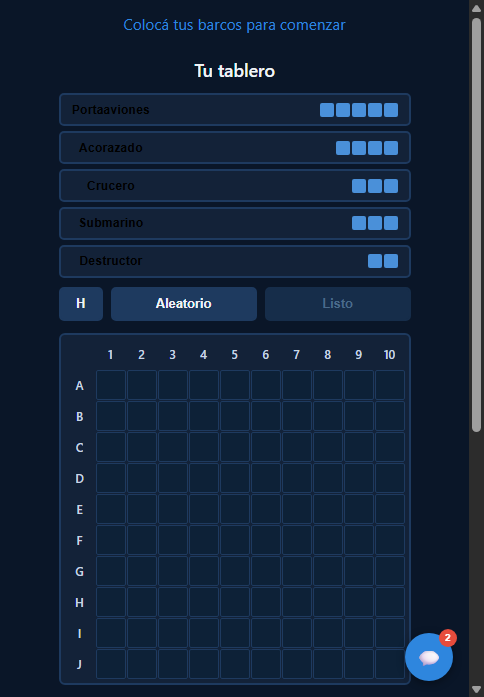
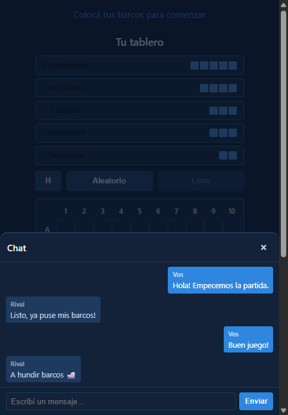
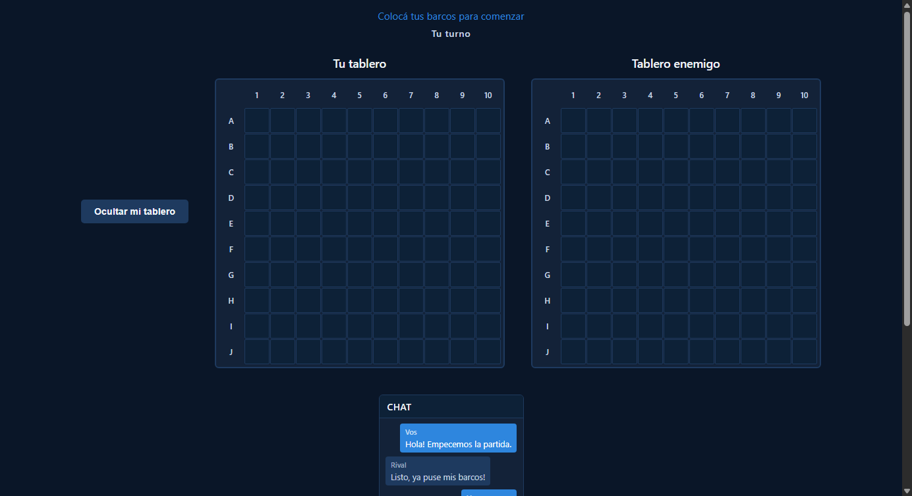

# Chat de Texto en Tiempo Real entre Jugadores

**ADW ID:** jfwocjz
**Fecha:** 2026-02-26
**Especificación:** specs/feature-47-chat-texto-tiempo-real.md

## Resumen

Se implementó un panel de chat en tiempo real que permite a ambos jugadores enviarse mensajes durante la partida, sincronizados a través de Firebase Realtime Database. En desktop el panel es una tercera columna siempre visible junto a los tableros; en mobile aparece como un botón flotante (FAB) con badge de mensajes no leídos que al tocarse abre un panel deslizante.

## Screenshots

## Lo Construido

- Panel de chat desktop (`#chat-panel`) como tercera columna en `#game-container`
- Botón flotante FAB (`#chat-fab`) para mobile con badge numérico de no leídos (`#chat-badge`)
- Panel overlay deslizante (`#chat-overlay`) para mobile con animación `slide-up`
- Funciones Firebase `sendMessage()`, `listenMessages()`, `destroyMessages()` en `firebase-game.js`
- Lógica de chat en `game.js`: renderizado de mensajes, envío, badge, limpieza en revancha
- Limpieza del nodo `messages` en Firebase al hacer revancha vía `resetRoom()`

## Implementación Técnica

### Archivos Modificados

- `js/firebase-game.js`: nuevas funciones de mensajería y limpieza de mensajes en `resetRoom()`
- `js/game.js`: `initChat()`, `handleMessagesUpdate()`, `sendChatMessage()` e integración en `handleBothConnected()` y `handleReturnToPlacing()`
- `index.html`: estructura HTML del panel de chat desktop, FAB mobile y overlay mobile
- `css/styles.css`: variable `--chat-width: 220px`, estilos de `.chat-column`, `.chat-messages`, `.chat-msg`, `.chat-form`, `#chat-fab`, `.chat-badge`, `.chat-overlay` y media queries

### Cambios Clave

- **Firebase**: se usa `push()` para escritura sin race conditions y `onValue` para escuchar `rooms/{roomId}/messages`; los mensajes se ordenan por `timestamp` en el cliente
- **Renderizado completo**: en cada actualización se re-renderiza la lista completa de mensajes para evitar duplicados al reconectar
- **Badge mobile**: se detectan mensajes nuevos comparando `messages.length` con `_prevMsgCount`; el badge se limpia al abrir el overlay
- **Responsive**: en desktop (`>900px`) el panel se muestra inline en el flex container; en mobile (`≤900px`) el panel se oculta y el FAB se activa via `hidden` + media queries
- **Revancha**: `resetRoom()` escribe `null` en `rooms/{roomId}/messages` y la UI se limpia en `handleReturnToPlacing()`
- **Accesibilidad**: `role="log"` y `aria-live="polite"` en los contenedores de mensajes; `aria-haspopup="dialog"` en el FAB

## Cómo Usar

1. Crear o unirse a una sala hasta que ambos jugadores estén conectados
2. En desktop: el panel de chat aparece automáticamente como tercera columna a la derecha del tablero enemigo
3. En mobile: tocar el botón 💬 en la esquina inferior derecha para abrir el chat
4. Escribir un mensaje en el campo de texto y presionar "Enviar" o Enter
5. Los mensajes propios se muestran alineados a la derecha (etiqueta "Vos"); los del rival a la izquierda (etiqueta "Rival")
6. En mobile, el badge rojo indica mensajes no leídos; desaparece al abrir el panel

## Configuración

No requiere configuración adicional. Usa la misma instancia de Firebase Realtime Database ya configurada en `js/firebase-config.js`.

## Pruebas

1. Abrir el juego en dos pestañas o dispositivos y conectarse a la misma sala
2. Verificar que el panel de chat aparece una vez que ambos jugadores están conectados
3. Enviar mensajes desde cada pestaña y confirmar sincronización en tiempo real
4. Redimensionar a <900px y verificar que aparece el FAB y desaparece el panel
5. Enviar un mensaje con el overlay cerrado y comprobar que el badge se incrementa
6. Abrir el overlay y verificar que el badge desaparece
7. Presionar "Revancha" y verificar que los mensajes se borran en ambas pestañas
8. Recargar la página y verificar que la reconexión restaura los mensajes existentes

## Notas

- No se usaron librerías externas; solo el Firebase SDK ya importado en el proyecto
- El estado del panel (abierto/cerrado) es local y no se sincroniza con Firebase, igual que el toggle del tablero propio
- El FAB usa `display: flex` internamente para centrar el emoji; la visibilidad combina el atributo `hidden` (JS) con media queries (CSS)
- La animación `slide-up` del overlay mobile respeta `prefers-reduced-motion` (se desactiva)
