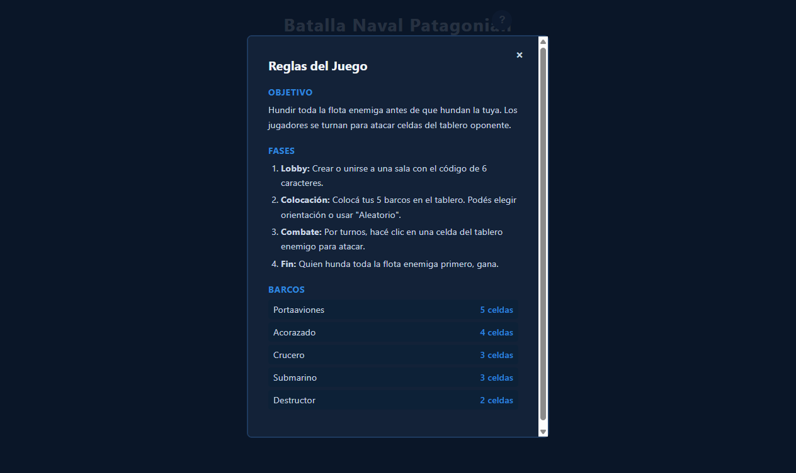
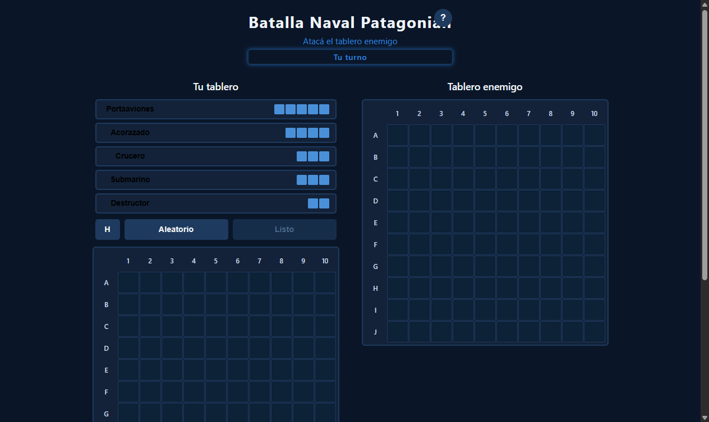

# Animaciones y Polish Visual

**ADW ID:** k4y1vjv
**Fecha:** 2026-02-20
**Especificación:** specs/feature-0023-animaciones-polish-visual.md

## Resumen

Se añadieron animaciones CSS y mejoras visuales al juego de Batalla Naval para hacer la experiencia más fluida, expresiva y satisfactoria. El foco está en feedback inmediato en los eventos más importantes del juego (ataque, hundimiento, cambio de turno, victoria/derrota), implementado puramente con CSS `@keyframes` y manipulación de clases JS, sin librerías externas. Todas las animaciones respetan `prefers-reduced-motion`.

## Screenshots







## Lo Construido

- **Animación de impacto en celda**: pulso rojo (`cell--anim-hit`) al acertar, ondulación gris (`cell--anim-miss`) al fallar — en ambos tableros (propio y enemigo)
- **Animación de barco hundido**: flash rojo (`cell--anim-sunk`) en las celdas del barco durante 600ms, con notificación pop de nombre del barco
- **Glow-pulse de turno**: el `#turn-indicator` pulsa con glow continuo cuando es el turno del jugador local (`turn-indicator--pulse`)
- **Animación de pantalla de fin**: el `#end-screen` hace fade-in + translateY al aparecer (`end-screen--enter`)
- **Pop de mensajes de estado**: el `#game-status` realiza un "pop" de escala al recibir mensajes importantes (`status--pop`)
- **Slide-in de historial**: el ítem más reciente del historial de ataques entra con slide desde arriba (`attack-history-item--new`)
- **Animación de modal de reglas**: la `.rules-dialog` hace slide-fade al abrirse (`rules-dialog--enter`)
- **Transiciones de pantalla suaves**: `showScreen`/`hideScreen` con `opacity` y `transitionend` para lobby → juego → fin

## Implementación Técnica

### Archivos Modificados
- `css/styles.css`: 8 nuevos `@keyframes`, 8 clases utilitarias de animación, supresión total en `prefers-reduced-motion`
- `js/game.js`: aplicación de clases de animación en `handleAttacksChange`, `updateFleetPanels`, `handleTurnChange`, `handleGameFinished`, y modal de reglas; helper `popStatus`; funciones `showScreen`/`hideScreen`

### Cambios Clave

**CSS — Keyframes añadidos:**
- `cell-hit-pulse`: escala 1→1.3→1 con fondo rojo brillante, 0.4s
- `cell-miss-ripple`: ondulación con sombra interna azul-gris, 0.4s
- `cell-sunk-flash`: parpadeo rojo intenso → rojo apagado, 0.6s
- `turn-glow-pulse`: box-shadow creciente en color primario, 1.2s infinite
- `end-screen-enter`: translateY(30px) opacity(0) → posición normal opacity(1), 0.5s
- `status-pop`: escala 1→1.08→1, 0.25s
- `slide-in-down`: translateY(-12px) opacity(0) → posición normal opacity(1), 0.2s
- `dialog-enter`: translateY(-20px) opacity(0) → posición normal opacity(1), 0.25s

**JS — Triggers de animación:**
- `handleAttacksChange`: añade `cell--anim-hit`/`cell--anim-miss` con `setTimeout` de 500ms de limpieza, para ataques recibidos y propios
- `updateFleetPanels`: detecta `newlySunk` comparando con `_prevEnemySunkIds`, aplica `cell--anim-sunk` con `setTimeout` de 700ms
- `handleTurnChange`: limpia `turn-indicator--pulse`, aplica en `requestAnimationFrame` si es turno local
- `handleGameFinished`: usa `showScreen(endScreen)` + `end-screen--enter` con listener `animationend`
- `popStatus(message)`: helper con `void el.offsetWidth` para re-trigger seguro de animación CSS
- `openRules()`: añade `rules-dialog--enter` y limpia en `animationend`
- Historial: `index === 0` recibe `attack-history-item--new` (persiste, no se repite)

**Supresión `prefers-reduced-motion`:**
```css
@media (prefers-reduced-motion: reduce) {
  .cell--anim-hit, .cell--anim-miss, .cell--anim-sunk,
  .turn-indicator--pulse, .end-screen--enter > *,
  .status--pop, .attack-history-item--new, .rules-dialog--enter {
    animation: none !important;
  }
}
```

## Cómo Usar

Las animaciones se activan automáticamente durante el juego:

1. **Atacar una celda**: hacer click en el tablero enemigo → el jugador ve un pulso rojo (impacto) o ondulación gris (fallo)
2. **Hundir un barco**: cuando el último hit completa un barco, sus celdas parpadean y aparece notificación pop
3. **Cambio de turno**: al ser el turno del jugador, el indicador de turno comienza a pulsar con glow
4. **Fin de partida**: al ganar o perder, la pantalla de resultado aparece con animación de entrada suave
5. **Modal de reglas**: hacer click en el botón "?" en el header → el diálogo aparece con slide-fade

## Configuración

No requiere configuración adicional. Las animaciones funcionan automáticamente con los archivos `css/styles.css` y `js/game.js` actualizados.

Para desactivar animaciones del sistema: activar "Reducir movimiento" en las preferencias de accesibilidad del OS (o en DevTools → Rendering → Emulate CSS media feature `prefers-reduced-motion: reduce`).

## Pruebas

### Prueba manual básica
1. Iniciar servidor: `python -m http.server 8000`
2. Abrir dos ventanas en `http://localhost:8000`
3. Crear sala en una, unirse con el código en la otra
4. Colocar barcos en ambas y comenzar combate
5. Atacar celdas: verificar pulso rojo (hit) u ondulación gris (miss)
6. Hundir un barco completo: verificar flash en celdas + pop de nombre
7. Observar `#turn-indicator`: debe pulsar en el jugador cuyo turno es
8. Terminar partida: verificar fade-in animado de `#end-screen`
9. Abrir modal de reglas (botón "?"): verificar slide-fade al aparecer

### Prueba `prefers-reduced-motion`
- DevTools → Rendering → Emulate `prefers-reduced-motion: reduce`
- Repetir pasos anteriores: el juego debe ser 100% funcional sin ninguna animación visible

### Prueba de rendimiento
- DevTools → Performance → Grabar 5 ataques
- Verificar que no hay layout thrashing (las animaciones usan `transform` y `opacity`)

## Notas

- Las animaciones de `background` en hit/miss son breves y en elementos pequeños, aceptando el costo mínimo de repaint sobre la ganancia de experiencia de usuario.
- El helper `popStatus` usa `void el.offsetWidth` (reflow intencional y mínimo) para garantizar que la animación CSS se re-dispara correctamente cuando el mensaje cambia rápido.
- La animación de salida del modal de reglas se omitió intencionalmente: el cierre inmediato es preferible a una animación que el usuario puede no ver si hace click rápido.
- La condición `_prevEnemySunkIds` evita re-disparar la animación de hundimiento en re-syncs de Firebase para barcos ya hundidos.
