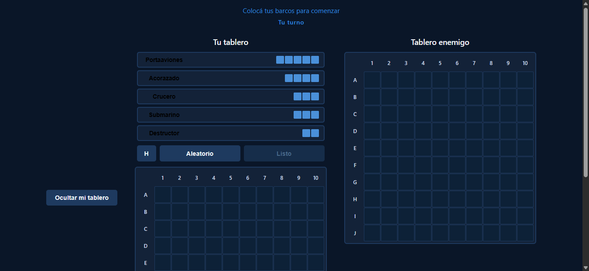
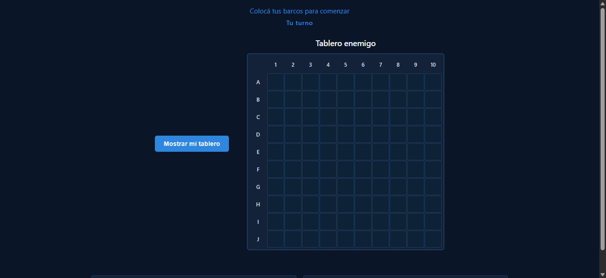
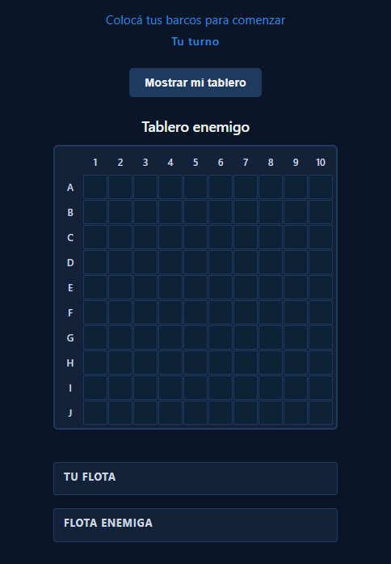
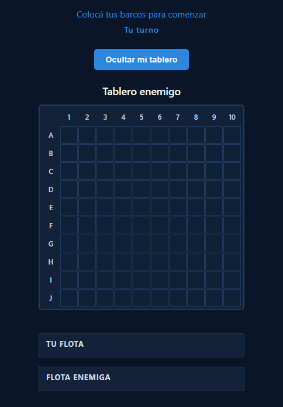

# Botón Ocultar/Mostrar Tablero Propio (Todas las Pantallas)

**ADW ID:** m6hnsr5
**Fecha:** 2026-02-26
**Especificación:** specs/feature-40-boton-ocultar-mostrar-tablero-propio.md

## Resumen

Se extendió el botón de toggle del tablero propio (introducido en feature #39) para que funcione en todos los tamaños de pantalla (desktop y mobile), cambiando su semántica de "alternar entre tableros" a "ocultar/mostrar únicamente el tablero propio". El tablero enemigo ahora permanece siempre visible sin importar el estado del toggle ni el breakpoint activo.

## Screenshots

### Desktop — Ambos tableros visibles (estado por defecto)


### Desktop — Tablero propio oculto, enemigo expandido


### Mobile — Estado por defecto (solo tablero enemigo)


### Mobile — Tablero propio visible junto al enemigo


### Mobile — Estado activo del botón toggle


## Lo Construido

- Botón "Ocultar mi tablero" visible en desktop (antes solo aparecía en mobile)
- Nueva semántica de toggle: oculta/muestra únicamente `#player-column`; `#enemy-column` nunca se oculta
- Inicialización contextual del texto del botón según breakpoint al iniciar combate
- Reset correcto del estado `--hiding-own` al finalizar la partida

## Implementación Técnica

### Archivos Modificados

- `css/styles.css`: Refactorización de reglas del botón toggle y columnas
- `js/game.js`: Actualización de lógica del toggle en `handleTurnChange` y `handleGameFinished`
- `index.html`: Actualización del texto/aria-label inicial del botón

### Cambios Clave

- **CSS**: Se eliminó `display: none` del selector base `#btn-toggle-board`, reemplazándolo por `display: inline-flex` — el botón ahora es visible en desktop cuando no tiene el atributo `[hidden]`
- **CSS**: Se reemplazó la clase `--showing-own` (que ocultaba `#enemy-column`) por `--hiding-own` (que solo oculta `#player-column`), eliminando completamente la regla que ocultaba el tablero enemigo
- **CSS**: Se agregó regla global `#game-container.--hiding-own #player-column { display: none; }` que aplica en todos los breakpoints
- **CSS**: Se eliminó la regla mobile `#btn-toggle-board:not([hidden]) { display: inline-flex; }` (ahora redundante con el selector base)
- **JS**: Al revelar el botón, se detecta el breakpoint con `window.matchMedia('(max-width: 900px)')` para inicializar el texto: "Mostrar mi tablero" en mobile, "Ocultar mi tablero" en desktop
- **JS**: El listener click ahora usa `classList.toggle('--hiding-own')` en lugar de `--showing-own`, con textos actualizados correspondientes
- **JS**: El reset en `handleGameFinished` elimina `--hiding-own` y restaura el texto a "Ocultar mi tablero"
- **HTML**: Texto inicial y `aria-label` del botón actualizados de "Ver mi tablero" a "Ocultar mi tablero"

## Cómo Usar

1. Iniciar una partida en dos pestañas: crear sala en una, unirse con el código en la otra
2. Colocar los barcos en ambas pestañas y presionar "Listo"
3. Al iniciar el combate:
   - **Desktop (>900px)**: aparece el botón "Ocultar mi tablero" — ambos tableros son visibles por defecto
     - Clic → el panel propio desaparece y el tablero enemigo ocupa todo el espacio; botón cambia a "Mostrar mi tablero"
     - Clic de nuevo → el panel propio reaparece; botón vuelve a "Ocultar mi tablero"
   - **Mobile (≤900px)**: aparece el botón "Mostrar mi tablero" — solo el tablero enemigo es visible por defecto
     - Clic → el tablero propio aparece apilado sobre el enemigo (que sigue visible); botón cambia a "Ocultar mi tablero"
     - Clic de nuevo → el tablero propio desaparece; botón vuelve a "Mostrar mi tablero"

## Pruebas

```bash
# Iniciar servidor local
python -m http.server 8000
# Abrir http://localhost:8000 en dos pestañas
```

1. Verificar en viewport >900px que el botón "Ocultar mi tablero" aparece al iniciar combate
2. Verificar en viewport >900px que clic colapsa el tablero propio y el enemigo se expande
3. Verificar en viewport ≤900px que el botón "Mostrar mi tablero" aparece al iniciar combate
4. Verificar en viewport ≤900px que el tablero enemigo nunca desaparece al pulsar el toggle
5. Terminar partida y verificar que el botón se oculta y el estado `--hiding-own` se elimina

## Notas

- El tablero enemigo nunca se oculta en ningún estado del toggle ni en ningún breakpoint — es el cambio principal respecto a la feature #39
- La clase CSS cambió de `--showing-own` (semántica positiva) a `--hiding-own` (semántica negativa), simplificando la lógica: `aria-pressed="true"` cuando el tablero propio está oculto
- El comportamiento diferenciado por breakpoint en el click se logra exclusivamente con CSS; JS solo inicializa el texto correcto al revelar el botón
- `firebase-game.js` no fue modificado — el toggle es estado puramente local
- En mobile, la regla CSS por defecto (`#btn-toggle-board:not([hidden]) ~ #player-column`) ya oculta `#player-column`; la clase `--hiding-own` en mobile produce el mismo efecto sin ocultar el enemigo
