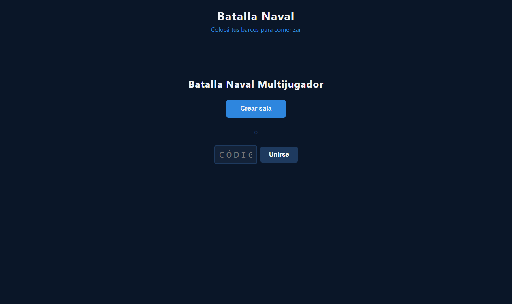
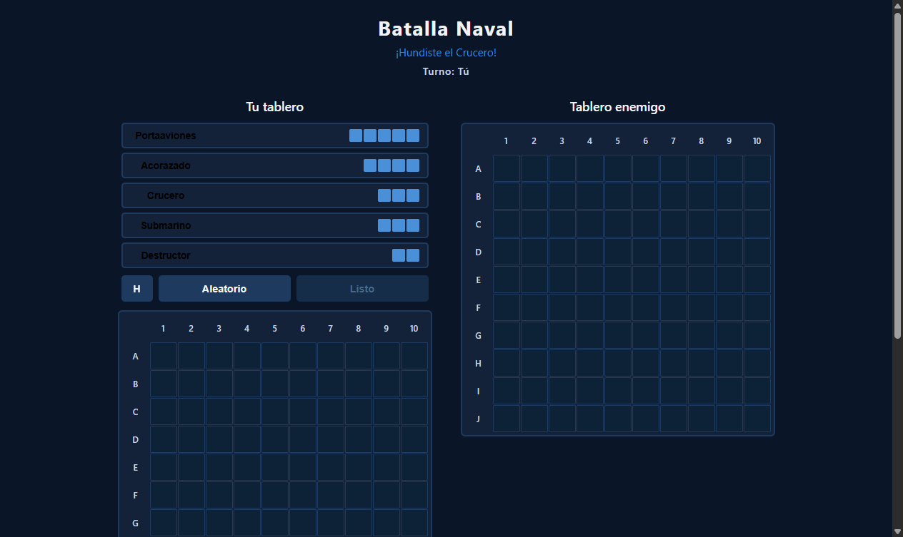

# Panel de Estado de Flota

**ADW ID:** puiojel
**Fecha:** 2026-02-20
**Especificación:** specs/feature-0017-panel-estado-flota.md

## Resumen

Se implementaron dos paneles de estado de flota visibles durante la fase de combate: "Tu Flota" y "Flota Enemiga". Cada panel lista los 5 barcos con indicadores visuales en tiempo real — punto verde y texto normal para barcos a flote, punto rojo con texto tachado para barcos hundidos — eliminando la necesidad de inferir el estado de la batalla contando impactos en el tablero.

## Screenshots







## Lo Construido

- Sección `#fleet-status` con dos paneles (`#player-fleet` y `#enemy-fleet`)
- Función pura `getSunkShips(attacks, ships)` que calcula barcos hundidos
- Función `renderFleetPanel(panelId, sunkIds)` que actualiza el DOM del panel
- Función `updateFleetPanels(attacks)` que coordina ambos paneles y emite notificaciones
- Constante `SHIPS` con los 5 barcos del juego y sus nombres en español
- Notificación automática "¡Hundiste el [nombre]!" al hundir un barco enemigo
- Layout responsive: fila en desktop, columna en móvil (< 900px)

## Implementación Técnica

### Archivos Modificados

- `index.html`: Sección `#fleet-status` agregada dentro de `#game-container`, antes de `#attack-history`, con atributo `hidden` inicial
- `css/styles.css`: Estilos para `#fleet-status`, `.fleet-panel`, `.fleet-list`, `.fleet-item`, `.fleet-item--sunk`; media query responsive en `< 900px`
- `js/game.js`: Función pura `getSunkShips`, constante `SHIPS`, funciones `renderFleetPanel` y `updateFleetPanels`, variable de estado `_prevEnemySunkIds`

### Cambios Clave

- `getSunkShips` normaliza los IDs de celda aplicando `.replace('cell-', '')` para reconciliar el formato de ataques (`'A1'`) con el de Firebase (`'cell-A1'`)
- `_prevEnemySunkIds` evita notificaciones duplicadas cuando `handleAttacksChange` recibe el historial completo (por ejemplo, al reconectar)
- El panel se activa en `handleTurnChange` solo cuando está oculto (`fleetStatus.hidden`), evitando reset en cada cambio de turno
- `updateFleetPanels` se llama al final de `handleAttacksChange` para sincronizar con cada ataque registrado

## Cómo Usar

1. Dos jugadores se unen a la misma sala y completan la fase de colocación
2. Al comenzar el combate, los paneles "Tu Flota" y "Flota Enemiga" aparecen automáticamente
3. Los barcos a flote muestran un punto verde (●); los hundidos aparecen en rojo, tachados y con opacidad reducida
4. Al hundir un barco enemigo, el mensaje "¡Hundiste el [nombre]!" aparece en `#game-status`
5. Los paneles se actualizan en tiempo real con cada ataque sin recargar la página

## Configuración

Sin configuración adicional. Los paneles se muestran/ocultan automáticamente según la fase del juego (`#fleet-status` tiene `hidden` en el HTML; `handleTurnChange` lo revela al inicio del combate).

## Pruebas

```js
// Simular combate en la consola del navegador (localhost:8000)
document.getElementById('fleet-status').hidden = false;

// Simular un barco hundido en "Flota Enemiga"
document.querySelector('#enemy-fleet .fleet-list').innerHTML = `
  <li class="fleet-item fleet-item--sunk">Destructor</li>
  <li class="fleet-item">Crucero</li>
`;
```

Para prueba completa: abrir dos pestañas en `http://localhost:8000`, completar lobby y colocación, y verificar que los paneles aparecen al iniciar el combate.

## Notas

- `getSunkShips` es una función pura sin efectos secundarios: no accede al DOM ni a Firebase
- Los paneles se ocultan implícitamente al final de la partida porque el contenedor padre `#game-container` se oculta en `handleGameFinished`
- La notificación de barco hundido solo se muestra para barcos enemigos; no hay notificación cuando el oponente hunde uno de los propios barcos del jugador
