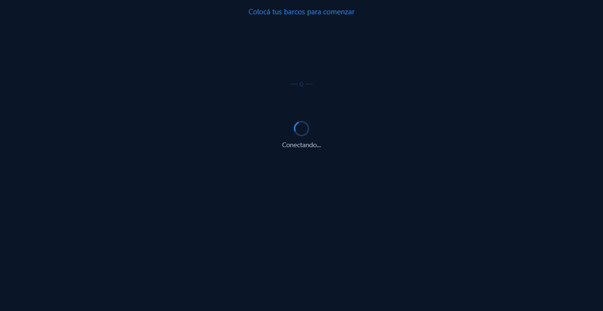
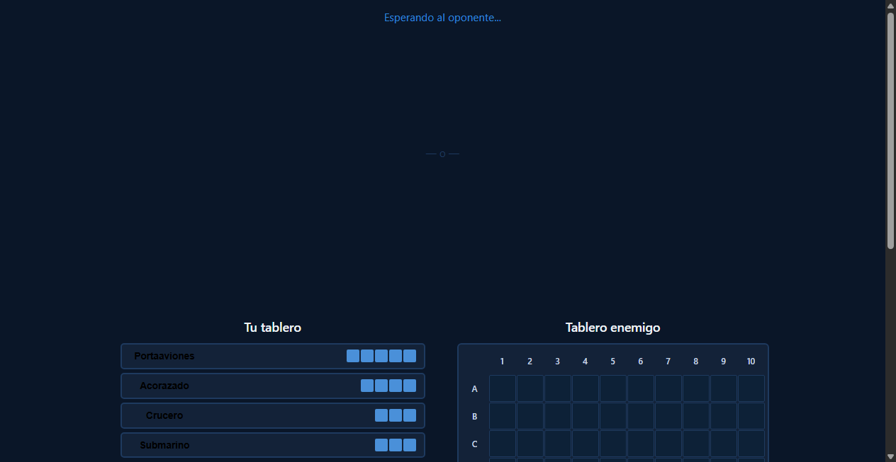
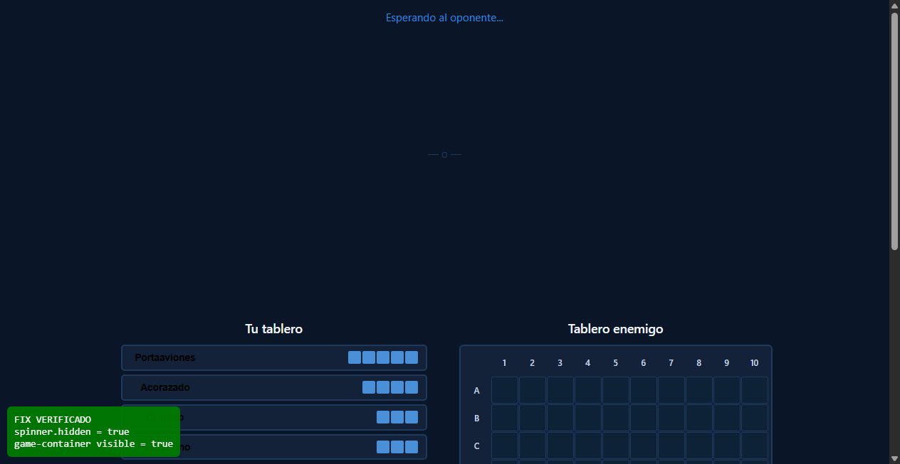

# Bug Fix: Spinner permanente al unirse a sala

**ADW ID:** qhgxvoi
**Fecha:** 2026-02-24
**Especificación:** specs/bug-30-spinner-permanente-unirse.md

## Resumen

Se corrigió un bug donde el spinner "Conectando..." permanecía visible indefinidamente cuando un jugador se unía a una sala existente usando el código de sala. La corrección agrega una llamada a `hideSpinner()` en el camino de éxito del handler de `join-form`, haciendo el flujo simétrico al de "Crear sala".

## Screenshots







## Lo Construido

- Corrección de una línea en `js/game.js` que añade `hideSpinner()` antes de `handleBothConnected()` en el flujo de unión a sala

## Implementación Técnica

### Archivos Modificados
- `js/game.js`: Agregada llamada a `hideSpinner()` en el bloque `try` del handler de `join-form`, inmediatamente antes de `handleBothConnected()`

### Cambios Clave
- **Antes (incorrecto):** `handleBothConnected()` se llamaba sin ocultar el spinner, dejándolo superpuesto sobre el tablero de juego
- **Después (correcto):** `hideSpinner()` se llama antes de `handleBothConnected()`, haciendo que la transición sea limpia

```js
// Antes (incorrecto):
var result = await FirebaseGame.joinRoom(code, playerId);
window.Game.roomId = result.roomId;
window.Game.playerKey = result.playerKey;
handleBothConnected();

// Después (correcto):
var result = await FirebaseGame.joinRoom(code, playerId);
window.Game.roomId = result.roomId;
window.Game.playerKey = result.playerKey;
hideSpinner();
handleBothConnected();
```

## Cómo Usar

1. Jugador 1 crea una sala y obtiene el código de sala
2. Jugador 2 abre el juego, ingresa el código en el lobby y presiona "Unirse"
3. El spinner "Conectando..." aparece brevemente durante la conexión
4. Al conectarse correctamente, el spinner se oculta y el tablero de juego aparece limpio

## Configuración

Sin configuración adicional requerida. El fix es transparente para el usuario.

## Pruebas

1. Abrir dos pestañas del navegador en `http://localhost:8000`
2. Pestaña 1: Crear sala → copiar el código generado
3. Pestaña 2: Ingresar el código → presionar "Unirse"
4. Verificar que el spinner desaparece correctamente al entrar al juego
5. Verificar que el flujo de "Crear sala" sigue funcionando (sin regresión)
6. Verificar que el error handling con código inválido sigue mostrando el error

## Notas

- La corrección es mínima: una sola línea añadida (`hideSpinner()`) en `js/game.js` línea ~590
- El bloque `catch` ya llamaba `hideSpinner()` correctamente en el caso de error; solo faltaba la llamada en el camino de éxito
- El spinner está definido en `index.html` (`#loading-spinner`) y `hideSpinner()` ya funcionaba correctamente — solo faltaba la invocación
