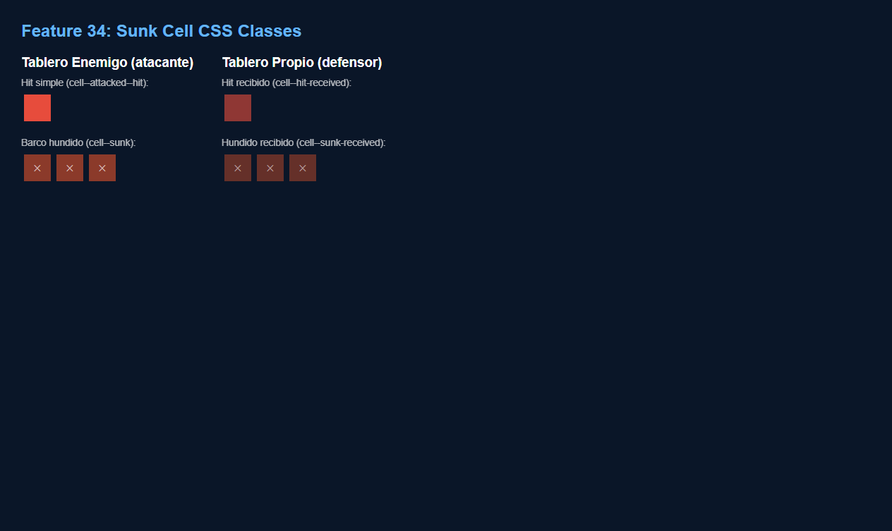
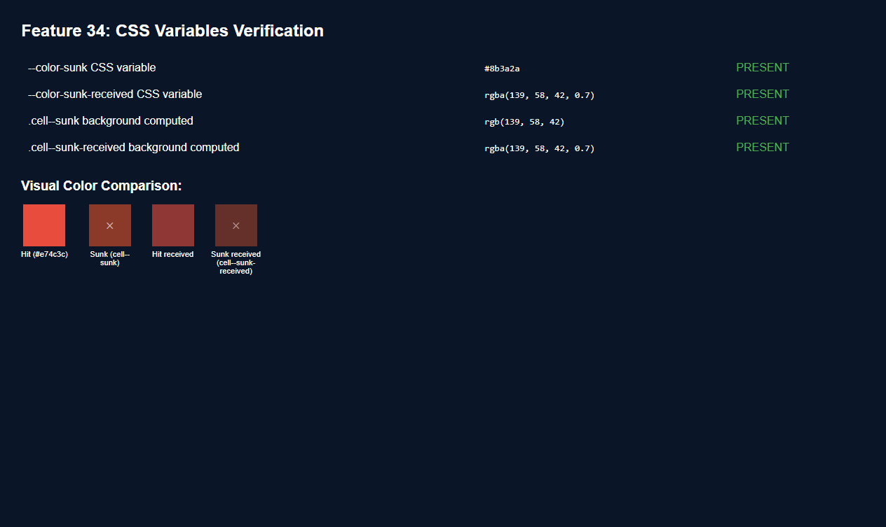
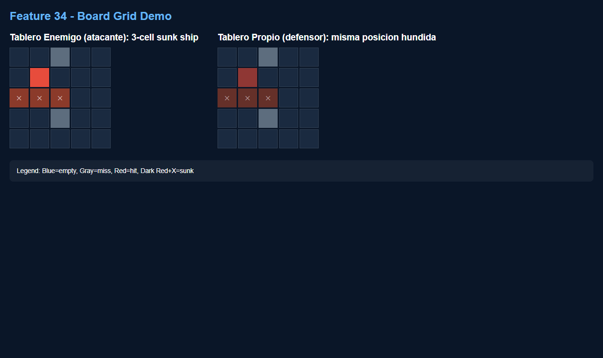
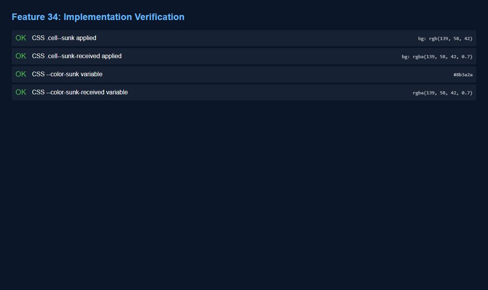

# Marcar Visualmente Barcos Hundidos

**ADW ID:** qm5w88b
**Fecha:** 2026-02-25
**Especificación:** specs/feature-34-marcar-visualmente-barcos-hundidos.md

## Resumen

Se implementó un marcado visual permanente y distintivo para las celdas de barcos completamente hundidos en el tablero de batalla naval. Cuando un barco es hundido, sus celdas reciben un color rojo oscuro con un símbolo ✕, diferenciándose visualmente de los hits simples tanto en el tablero enemigo (vista del atacante) como en el tablero propio (vista del defensor).

## Screenshots

## Lo Construido

- Variables CSS `--color-sunk` y `--color-sunk-received` para colores de barcos hundidos
- Clase `.cell--sunk` para celdas hundidas en el tablero enemigo (rojo oscuro `#8b3a2a` con ✕)
- Clase `.cell--sunk-received` para celdas hundidas en el tablero propio (variante semitransparente con ✕)
- Función `markSunkCells()` en `game.js` que aplica las clases al DOM de forma idempotente
- Integración en `updateFleetPanels()` para marcar ambos tableros tras cada ataque

## Implementación Técnica

### Archivos Modificados
- `css/styles.css`: Variables CSS para colores de hundido y clases `.cell--sunk` / `.cell--sunk-received` con pseudo-elemento `::after` decorativo
- `js/game.js`: Función `markSunkCells()` y llamadas desde `updateFleetPanels()`

### Cambios Clave
- Se añaden `--color-sunk: #8b3a2a` y `--color-sunk-received: rgba(139, 58, 42, 0.7)` en `:root`
- Las clases `.cell--sunk` y `.cell--sunk-received` usan `!important` en `background` para sobrescribir los estilos de hit ya aplicados
- El pseudo-elemento `::after` con `content: '\2715'` (✕) usa `position: absolute; inset: 0` para cubrir toda la celda
- `markSunkCells(sunkIds, ships, boardPrefix, sunkClass)` itera los barcos hundidos y aplica la clase correspondiente usando `classList.add` (idempotente)
- Se llama `markSunkCells(mySunk, myShips, '', 'cell--sunk-received')` para el tablero propio del defensor
- Se llama `markSunkCells(enemySunk, enemyShips, 'enemy-', 'cell--sunk')` para el tablero enemigo del atacante

## Cómo Usar

1. Durante el combate, atacar celdas del tablero enemigo normalmente
2. Al hundir un barco completo, todas sus celdas cambian automáticamente a rojo oscuro con ✕
3. El cambio es visible tanto para el atacante (tablero enemigo) como para el defensor (tablero propio)
4. El estilo persiste ante re-renders del listener de Firebase

## Configuración

No requiere configuración adicional. Los cambios son puramente en CSS y lógica JS local del cliente.

## Pruebas

1. Iniciar servidor local: `python -m http.server 8000`
2. Abrir dos ventanas del navegador en `http://localhost:8000`
3. Crear sala en ventana A, unirse en ventana B
4. Colocar todos los barcos en ambas ventanas
5. Atacar y hundir un barco completo (ej. destructor de 2 celdas)
6. Verificar que las celdas del barco hundido cambian a rojo oscuro con ✕ en el tablero enemigo del atacante
7. Verificar que las mismas celdas aparecen con rojo semitransparente oscuro con ✕ en el tablero propio del defensor
8. Verificar que las celdas de hits simples (barco no hundido) conservan el rojo brillante sin ✕
9. Recargar una pestaña y verificar que el marcado de hundido persiste tras re-sync con Firebase

## Notas

- El `!important` en `background` es necesario para sobrescribir las clases `cell--attacked--hit` y `cell--hit-received` ya aplicadas. Es la solución mínima que no rompe el flujo existente.
- La función `markSunkCells` es idempotente: `classList.add` no duplica clases, por lo que llamarla múltiples veces (re-renders de Firebase) no produce efectos secundarios.
- Esta feature agrega el estado visual *permanente* post-hundimiento, y no modifica la animación temporal `cell--anim-sunk` que ya existía para el flash visual al momento del hundimiento.
- El pseudo-elemento `::after` requiere `position: relative` en la celda padre; el `position: absolute; inset: 0` cubre toda la celda sin afectar el layout.
