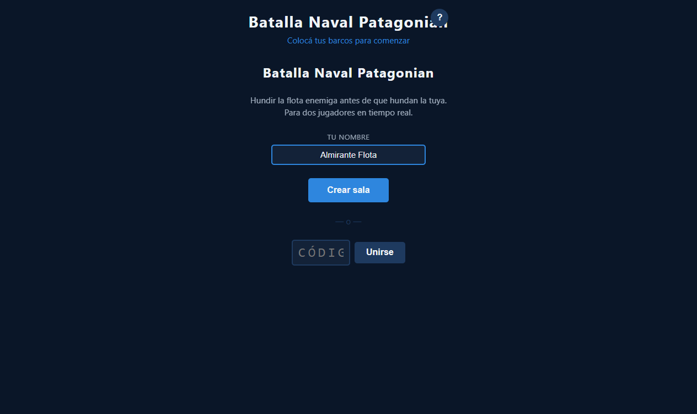

# Pantalla de Inicio y Mejoras Generales de UX

**ADW ID:** r9ieh9o
**Fecha:** 2026-02-20
**Especificación:** specs/feature-0019-pantalla-inicio-mejoras-ux.md

## Resumen

Se mejoró la experiencia del usuario añadiendo una pantalla de inicio más completa e identitaria para "Batalla Naval Patagonian", con personalización de nombre de jugador, un spinner de carga durante operaciones Firebase, transiciones suaves entre fases del juego y un modal de reglas accesible desde cualquier momento. Estas mejoras transforman una interfaz austera en una experiencia visual pulida y con contexto claro en todo momento.

## Screenshots

## Lo Construido

- Título actualizado a "Batalla Naval Patagonian" con descripción del juego en el lobby
- Input de nombre del jugador (default "Jugador 1") persistido en `window.Game.playerName`
- Spinner de carga CSS puro que reemplaza el formulario durante operaciones Firebase
- Transiciones fade de 300ms entre fases (lobby → juego → fin) usando `requestAnimationFrame`
- Modal de reglas accesible con botón "?" en el header, cierra con Escape, clic fuera o botón "×"
- Mensajes de estado claros y descriptivos en cada fase del juego

## Implementación Técnica

### Archivos Modificados
- `index.html`: Añadido título actualizado, descripción del lobby, input de nombre, spinner de carga, botón "?" en header y modal de reglas completo con secciones de objetivo, fases y barcos
- `css/styles.css`: Añadidos estilos para `.lobby-description`, `.player-name-group`, `#input-player-name`, `#loading-spinner`, `.spinner` (keyframe `spin`), `.btn-rules`, `#rules-modal`, `.rules-dialog`, `.rules-ships`, clases de transición `.screen-transition`/`.screen-entering`/`.screen-visible`, y `@media (prefers-reduced-motion)`
- `js/game.js`: Añadidas funciones helper `showScreen()`, `hideScreen()`, `showSpinner()`, `hideSpinner()`, lógica de lectura de nombre de jugador, integración del modal de reglas y reemplazo de asignaciones directas de `.hidden` con las funciones de transición

### Cambios Clave
- `showScreen(el)` / `hideScreen(el)`: implementan fade usando doble `requestAnimationFrame` para garantizar el reflow CSS entre `.screen-entering` y `.screen-visible`; `hideScreen` usa `transitionend` para aplicar `hidden = true` solo después de que la animación termina
- `showSpinner()` / `hideSpinner()`: ocultan/muestran el formulario, botones, input de nombre y divisor, reemplazando el antiguo `setLobbyFormEnabled(false)`
- El nombre del jugador se lee en tiempo real del input y se expone como `window.Game.playerName` para uso global
- La prevención de doble envío se logra implícitamente: el spinner oculta los botones de acción
- Se añadió `@media (prefers-reduced-motion: reduce)` para desactivar transiciones en usuarios que lo requieran

## Cómo Usar

1. Abrir `http://localhost:8000` para ver la pantalla de inicio con el nuevo título y descripción
2. Ingresar un nombre personalizado en el campo "Tu nombre" (opcional, default "Jugador 1")
3. Hacer clic en "?" en el header para abrir el modal de reglas; cerrar con Escape, "×" o clic fuera
4. Crear o unirse a una sala: el formulario se reemplaza por un spinner de carga durante la conexión
5. Al conectarse el segundo jugador, el lobby hace fade-out y el tablero hace fade-in suavemente
6. Al terminar la partida, el tablero hace fade-out y la pantalla de fin hace fade-in

## Configuración

No se requiere configuración adicional. El nombre del jugador está disponible globalmente en `window.Game.playerName` para features futuras (chat, ranking, etc.).

## Pruebas

1. Abrir `localhost:8000` → verificar título "Batalla Naval Patagonian" y descripción visible
2. Escribir un nombre → abrir consola → verificar `window.Game.playerName` tiene el valor correcto
3. Dejar el nombre vacío → crear sala → verificar que `window.Game.playerName` es "Jugador 1"
4. Hacer clic en "Crear sala" → verificar que el spinner aparece y el formulario desaparece
5. Abrir el modal "?" → verificar las tres secciones (Objetivo, Fases, Barcos)
6. Cerrar el modal con Escape, "×" y clic fuera → verificar que los tres métodos funcionan
7. Conectar dos pestañas → verificar transición suave lobby → tablero al unirse el segundo jugador
8. Completar una partida → verificar transición suave tablero → pantalla de fin

## Notas

- El spinner usa CSS puro (keyframe `spin`) sin dependencias externas, consistente con el stack sin librerías del proyecto
- Las transiciones de fase usan el patrón doble `requestAnimationFrame` para forzar reflow entre añadir `.screen-entering` y `.screen-visible`, garantizando que la transición CSS se active correctamente en todos los navegadores
- `hideScreen` espera al evento `transitionend` antes de aplicar `hidden = true`, evitando saltos visuales
- No se modificaron `firebase-game.js` ni `placement.js`
- El modal de reglas usa atributos ARIA (`role="dialog"`, `aria-modal="true"`, `aria-labelledby`) para accesibilidad
