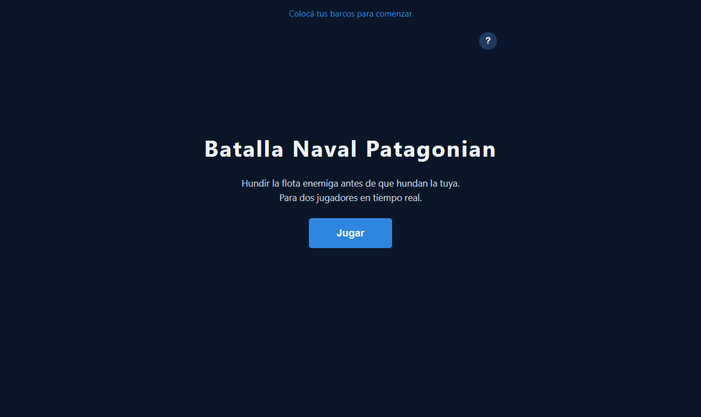
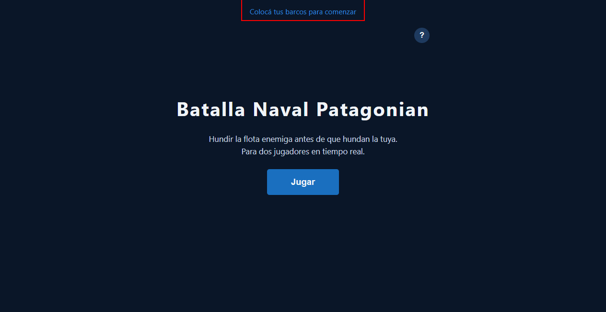

# Pantalla de Inicio Separada del Lobby

**ADW ID:** sd7t1vm
**Fecha:** 2026-02-20
**Especificación:** specs/feature-25-pantalla-inicio-separada.md

## Resumen

Se separó la pantalla de inicio del lobby en dos secciones independientes: una pantalla hero (`#home-screen`) visible al cargar la página con título, descripción y botón "Jugar", y un lobby limpio que solo muestra los controles de sala. Esto elimina la duplicación del título y reposiciona el botón "?" de reglas dentro de la pantalla de inicio, evitando la superposición con el header.

## Screenshots

## Lo Construido

- Sección `#home-screen` como punto de entrada con diseño hero centrado verticalmente
- Botón `#btn-play` prominente para navegar al lobby
- Botón "?" de reglas reubicado en `#home-screen` (esquina superior derecha, `position: absolute`)
- Modal de reglas completo (`#rules-modal`) con overlay, contenido detallado y cierre con Escape/clic fuera
- Header minimalista — solo `#game-status` y `#turn-indicator`, sin `<h1>`
- Lobby con campo de nombre de jugador (`#input-player-name`) y spinner de carga (`#loading-spinner`)
- Paneles de estado de flota (`#fleet-status`) visibles durante el combate

## Implementación Técnica

### Archivos Modificados

- `index.html`: añadida `#home-screen`, eliminado `<h1>` del header, lobby con `hidden` por defecto, añadidos `#loading-spinner`, `#fleet-status` y `#rules-modal`
- `css/styles.css`: estilos para `#home-screen`, `#btn-play`, `.home-description`, `.btn-rules` reposicionado, header reducido, estilos de fleet panels, spinner, modal de reglas y transiciones de pantalla
- `js/game.js`: listener para `#btn-play` que ejecuta `hideScreen(homeScreen)` + `showScreen(lobbyScreen)`; funciones `showScreen`/`hideScreen` con animación CSS; `showSpinner`/`hideSpinner` actualizados para campo de nombre y divider

### Cambios Clave

- `#home-screen` usa `position: relative` + `min-height: 80vh` para centrado vertical con `flex`
- Transiciones de pantalla mediante clases CSS (`screen-transition`, `screen-entering`, `screen-visible`) gestionadas con `requestAnimationFrame`
- `hideScreen` escucha `transitionend` antes de aplicar `hidden`, garantizando la animación de salida
- `window.location.reload()` en "Salir" y "Revancha" vuelve naturalmente a `#home-screen` (visible por defecto, lobby con `hidden`)
- El listener de `btn-rules` sigue usando `document.getElementById('btn-rules')` sin cambios — el elemento conservó su ID al moverse al home screen
- `showSpinner`/`hideSpinner` manejan con `if (el)` el caso en que `.lobby-description` ya no existe en el DOM

## Cómo Usar

1. Abrir `http://localhost:8000` — aparece `#home-screen` con título y botón "Jugar"
2. Hacer clic en "?" (esquina superior derecha) para ver las reglas del juego
3. Hacer clic en "Jugar" — transición animada de 0.3 s hacia el lobby
4. En el lobby: ingresar nombre, crear sala o unirse con código de 6 caracteres
5. Al terminar la partida ("Salir" o "Revancha"), la recarga vuelve al home screen

## Configuración

Sin configuración adicional. La pantalla de inicio es visible por defecto; el lobby lleva el atributo `hidden` en el HTML.

## Pruebas

- Cargar `http://localhost:8000` → debe mostrarse `#home-screen` (no el lobby)
- Verificar que "Batalla Naval Patagonian" NO aparece duplicado en ninguna fase
- Hacer clic en "?" → modal de reglas abre sin superponerse al `<h1>`
- Hacer clic en "Jugar" → transición suave de 0.3 s al lobby; lobby sin título del juego
- Probar cierre del modal con botón ×, clic en overlay y tecla Escape
- Flujo completo con dos pestañas: Inicio → Lobby → Colocación → Combate → Fin → Salir → Inicio

## Notas

- La separación home/lobby facilita futuras mejoras como animaciones de entrada o un onboarding más rico sin afectar el flujo de sala
- El campo de nombre de jugador (`#input-player-name`) se agregó en esta feature junto con el lobby limpio
- Los estilos de `.lobby-title` y `.lobby-description` fueron eliminados del CSS ya que no hay elementos con esas clases en el HTML
