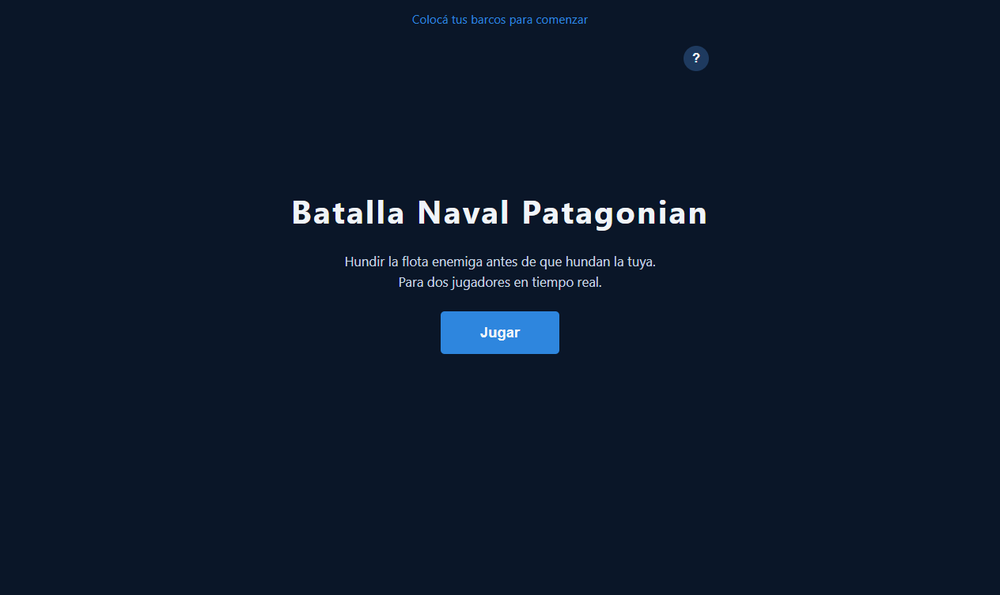
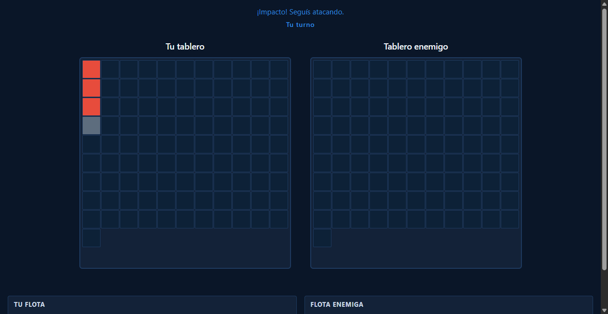
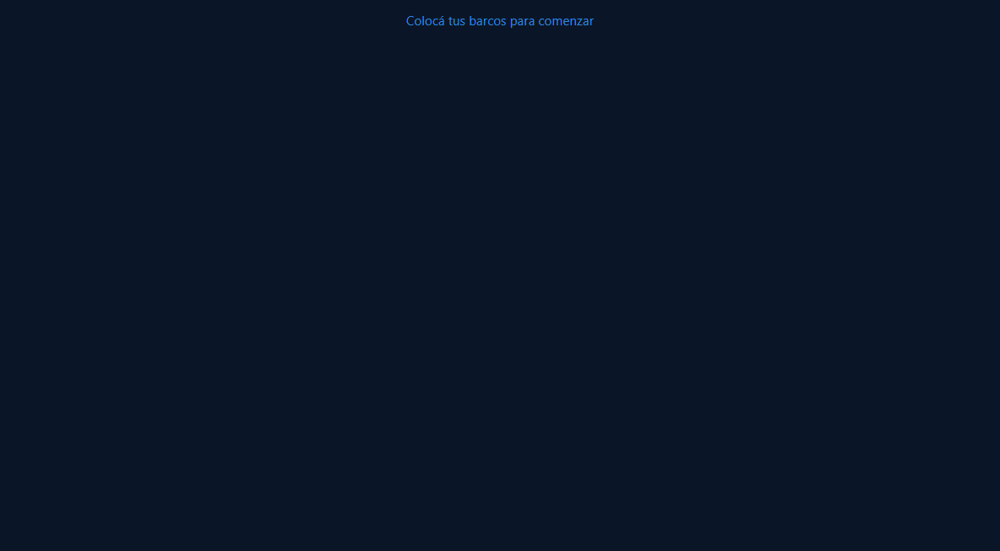
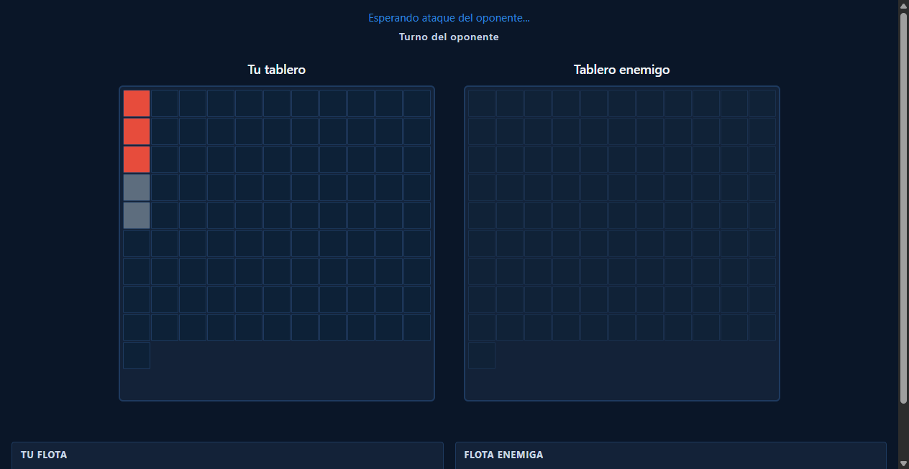
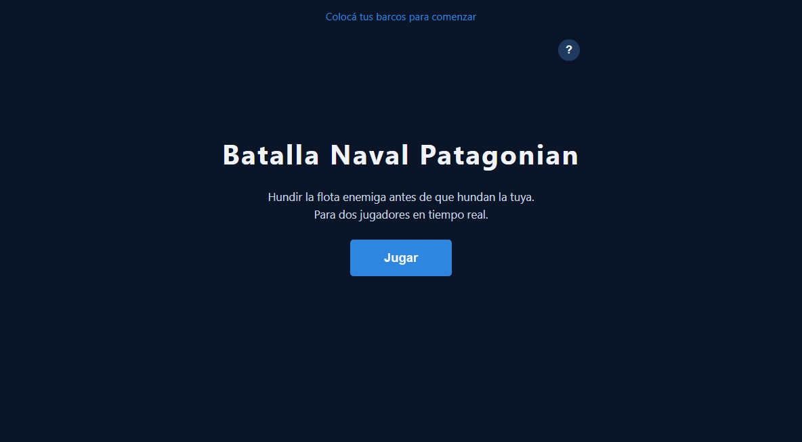

# Bug Fix: Turno Continuo al Impactar un Barco

**ADW ID:** thsrwd0
**Fecha:** 2026-02-25
**Especificación:** specs/bug-32-turno-continuo-impactar-barco.md

## Resumen

Se corrigió el comportamiento de turnos en el combate: antes, el turno siempre pasaba al oponente tras cada disparo sin importar el resultado. Ahora, un impacto (hit) premia al jugador activo con turno adicional, mientras que un fallo (miss) cede el turno al oponente, respetando las reglas estándar de Batalla Naval.

## Screenshots












## Lo Construido

- Lógica condicional de turnos en el handler de ataque: hit conserva el turno, miss lo cede al oponente
- Re-habilitación local e inmediata del tablero enemigo cuando el resultado es hit sin victoria
- Mensaje de feedback diferenciado: "¡Impacto! Seguís atacando." al conservar el turno
- Corrección adicional: ocultar spinner al unirse a una sala existente

## Implementación Técnica

### Archivos Modificados
- `js/game.js`: Modificado el handler de click en el tablero enemigo para condicionar la llamada a `setTurn` según el resultado del ataque; añadido `hideSpinner()` al flujo de unirse a sala

### Cambios Clave

**Lógica de turno condicional (líneas ~531-543):**

Antes:
```js
var nextTurn = window.Game.playerKey === 'player1' ? 'player2' : 'player1';
FirebaseGame.setTurn(window.Game.roomId, nextTurn);
```

Después:
```js
if (result === 'miss') {
  var nextTurn = window.Game.playerKey === 'player1' ? 'player2' : 'player1';
  FirebaseGame.setTurn(window.Game.roomId, nextTurn);
} else {
  // Hit sin victoria: el jugador conserva el turno
  _isMyTurn = true;
  if (enemyBoard) enemyBoard.classList.remove('board--disabled');
  popStatus('¡Impacto! Seguís atacando.');
}
```

- Al hacer **hit sin victoria**: `setTurn` no se llama → Firebase mantiene `currentTurn` sin cambios → el listener `onTurnChange` del oponente no dispara → ambos clientes permanecen en el estado correcto. Localmente se restaura `_isMyTurn = true` y se quita `board--disabled`.
- Al hacer **miss**: comportamiento anterior conservado — se llama `setTurn` con el jugador opuesto.
- Al hacer **hit con victoria**: el bloque de `setWinner` sigue ejecutándose con `return`, sin tocar la lógica de turno.

**Fix adicional (línea ~597):** Se agregó `hideSpinner()` justo después de resolver `joinRoom` para evitar que el spinner quede visible al unirse a una sala.

## Cómo Usar

1. Dos jugadores abren el juego y se conectan a la misma sala
2. Ambos colocan sus barcos
3. Durante el combate, el jugador activo ataca una celda del tablero enemigo:
   - Si hay un barco → el tablero permanece habilitado y aparece "¡Impacto! Seguís atacando." — el jugador puede continuar atacando
   - Si es agua → el tablero se deshabilita y el turno pasa al oponente

## Pruebas

1. Abrir `http://localhost:8000` en dos pestañas del navegador
2. Crear sala en pestaña 1 y unirse con el código en pestaña 2
3. Completar la fase de colocación en ambas pestañas
4. **Test hit:** atacar una celda que contiene un barco → verificar que el tablero permanece habilitado y aparece el mensaje "¡Impacto! Seguís atacando."
5. **Test miss:** atacar una celda vacía → verificar que el turno pasa al oponente y el tablero se deshabilita
6. **Test victoria:** hundir el último barco → verificar que la partida termina correctamente
7. **Test múltiples hits:** hacer varios hits consecutivos → verificar que el jugador puede atacar en cadena

## Notas

- El fix es mínimo y quirúrgico: solo modifica el bloque condicional dentro del `.then()` de `registerAttack` en `js/game.js`.
- No fue necesario modificar `firebase-game.js` ya que `setTurn` y `registerAttack` funcionan correctamente; solo cambia cuándo se llama a `setTurn`.
- El listener `onTurnChange` en `firebase-game.js` ya tiene una guarda `data.currentTurn !== _lastTurn`, garantizando que si el turno no cambia en Firebase, `handleTurnChange` no se llama — comportamiento correcto para el caso hit.
