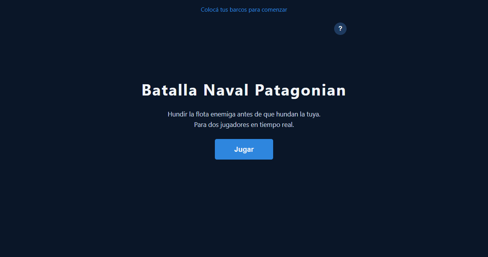
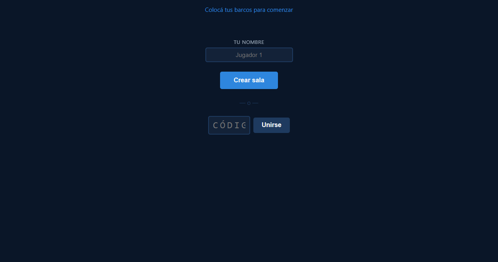
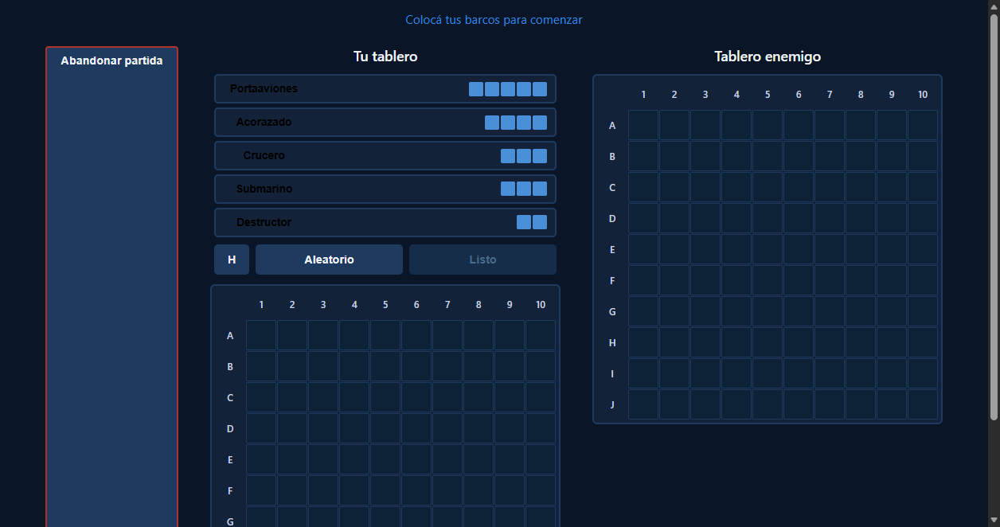
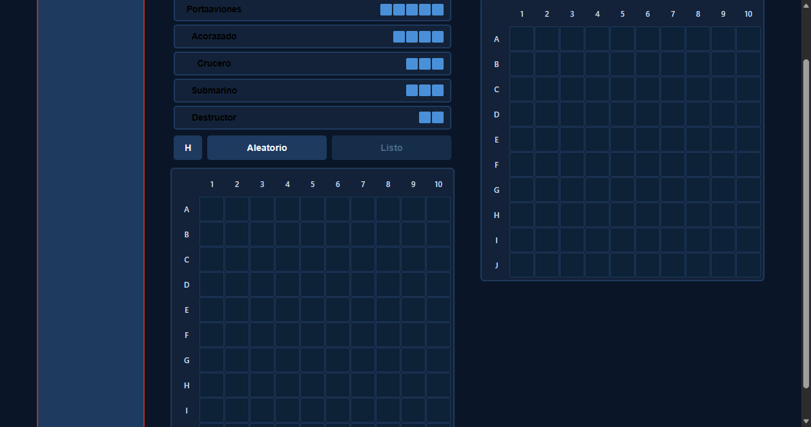
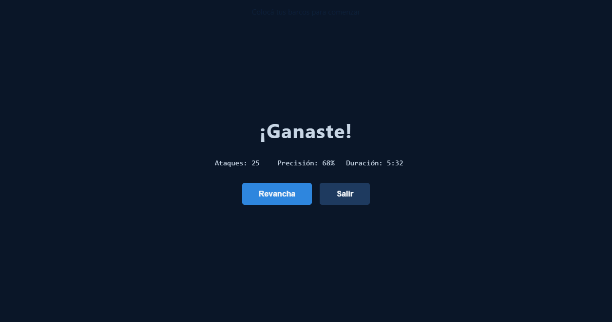

# Botón para Abandonar la Partida

**ADW ID:** vf43an6
**Fecha:** 2026-02-26
**Especificación:** specs/feature-49-boton-abandonar-partida.md

## Resumen

Se agregó un botón "Abandonar partida" visible durante las fases de colocación de barcos y combate. Al presionarlo, muestra un diálogo de confirmación nativo del navegador; si el jugador confirma, la sesión se limpia y la página se recarga llevándolo de vuelta al lobby. El botón hereda su visibilidad del contenedor `#game-container`, por lo que nunca aparece en el lobby, pantalla de inicio ni pantalla de fin de partida.

## Screenshots

## Lo Construido

- Botón `#btn-abandon` en `#game-container` con texto "Abandonar partida"
- Diálogo de confirmación nativo (`window.confirm()`) antes de abandonar
- Limpieza de sesión con `clearSession()` y recarga de página al confirmar
- Estilos CSS con borde rojo para diferenciarlo de botones primarios
- Efecto hover que rellena el fondo de rojo con texto blanco

## Implementación Técnica

### Archivos Modificados

- `index.html`: Se agregó `<button id="btn-abandon">` dentro de `#game-container`, junto al `#btn-toggle-board` existente
- `css/styles.css`: Se agregaron estilos para `#btn-abandon` con borde `#b03030` y hover destructivo
- `js/game.js`: Se agregó el event listener para `#btn-abandon` reutilizando `clearSession()` ya importado desde `./session.js`

### Cambios Clave

- El botón no tiene atributo `hidden`, por lo que su visibilidad queda acoplada automáticamente al contenedor padre `#game-container`
- Se reutiliza `clearSession()` ya importado en `game.js` desde `./session.js`, sin agregar nueva lógica de Firebase
- El flujo de abandono es: `window.confirm()` → si acepta → `clearSession()` → `window.location.reload()`
- No se notifica al oponente en Firebase; el listener `onDisconnect` existente ya propaga la desconexión

## Cómo Usar

1. Unirse o crear una sala y esperar a que el oponente se conecte
2. Una vez en la fase de colocación de barcos, el botón "Abandonar partida" aparece en la parte superior del juego
3. Hacer click en "Abandonar partida"
4. En el diálogo de confirmación, hacer click en "Aceptar" para salir o "Cancelar" para continuar jugando
5. Al confirmar, la sesión se limpia y la página regresa a la pantalla de inicio

## Configuración

Sin configuración adicional. El botón funciona con la infraestructura existente de `session.js` y `game.js`.

## Pruebas

1. **Flujo cancelar:** Fase de colocación → "Abandonar partida" → Cancelar → la partida continúa sin interrupciones
2. **Flujo confirmar (colocación):** Fase de colocación → "Abandonar partida" → Aceptar → recarga al lobby
3. **Flujo confirmar (combate):** Fase de combate → "Abandonar partida" → Aceptar → recarga al lobby
4. **No visible en lobby:** Verificar que el botón NO aparece antes de que el oponente se conecte
5. **No visible en fin de partida:** Terminar una partida → verificar que el botón NO aparece en la pantalla de victoria/derrota
6. **Sesión limpiada:** Tras confirmar abandono, verificar en DevTools → Application → Storage que los datos de sesión fueron eliminados

## Notas

- El diseño es minimalista (sin modal custom, sin librerías) siguiendo la convención del proyecto de usar APIs nativas del navegador
- Si en el futuro se desea notificar al oponente con un mensaje como "Tu oponente abandonó la partida", se podría agregar una llamada a Firebase antes del `reload()`, pero queda fuera del alcance de este issue
- En mobile, el diálogo nativo de `window.confirm()` es responsivo por defecto
- El botón es enfocable y activable con Enter/Space sin cambios adicionales de accesibilidad
