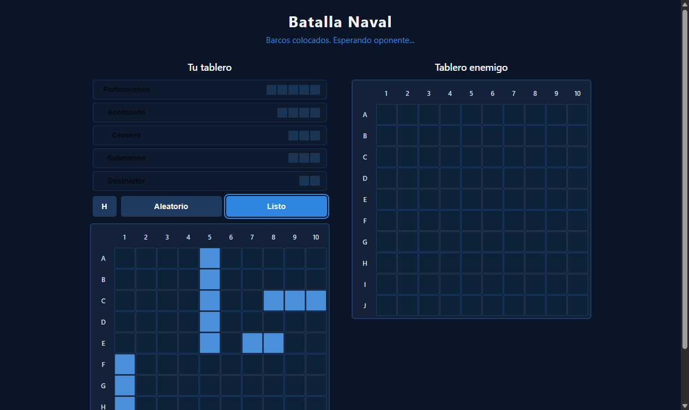
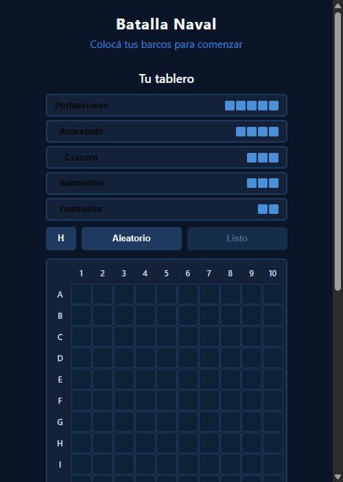

# Feature: Fase de Colocación de Barcos

**ADW ID:** wc5122r
**Fecha:** 2026-02-20
**Especificación:** specs/feature-002-ship-placement.md

## Resumen

Se implementó la fase de colocación de barcos previa al combate en Batalla Naval. El jugador puede colocar manualmente sus 5 barcos en un tablero de 10x10 mediante selección, orientación y click, o usar colocación aleatoria con un botón. El botón "Listo" se habilita únicamente cuando todos los barcos están colocados, exponiéndose el estado de la flota para las fases siguientes del juego.

## Screenshots

## Lo Construido

- Panel lateral con los 5 barcos disponibles (Portaaviones 5, Acorazado 4, Crucero 3, Submarino 3, Destructor 2)
- Preview hover con feedback visual verde (válido) / rojo (inválido) al posicionar barcos
- Toggle de orientación H/V con soporte de teclado y atributo `aria-pressed`
- Botón "Aleatorio" que coloca los 5 barcos en posiciones válidas automáticamente
- Botón "Listo" que se habilita al completar la flota y expone el estado al resto del juego
- Generación dinámica de celdas de ambos tableros (jugador y enemigo) con IDs y atributos de accesibilidad
- Soporte de teclado (Tab + Enter/Space) para colocar barcos
- Diseño responsive para desktop y mobile
- Soporte de `prefers-reduced-motion`

## Implementación Técnica

### Archivos Modificados

- `index.html`: Estructura HTML de la fase de colocación (`#placement-phase`, `#ship-list`, `.placement-controls`, `#btn-ready`)
- `css/styles.css`: Estilos completos del sistema de colocación
- `js/placement.js`: Módulo nuevo con toda la lógica de colocación (IIFE, API pública)
- `js/game.js`: Controlador principal que inicializa `Placement` y maneja el evento "Listo"

### Cambios Clave

- **`js/placement.js`** implementado como IIFE con API pública: `init()`, `getFleetState()`, `randomPlacement()`, `clearAllPlacements()`, y utilidades puras (`cellIdToCoords`, `coordsToCellId`, `getShipCells`, `isValidPlacement`)
- **`getShipCells(startCellId, size, orient)`** retorna `null` cuando el barco saldría del tablero, previniendo colocaciones inválidas
- **`isValidPlacement(cellIds, excludeShipId)`** valida sin superposición ni desbordamiento; `excludeShipId` permite recolocar un barco ya colocado
- **`randomPlacement()`** intenta hasta 200 posiciones por barco (mayor a menor) con hasta 5 reintentos globales
- **`generateBoard()`** crea dinámicamente las 100 celdas de cada tablero con `id="cell-A1"` para el jugador y `id="enemy-cell-A1"` para el enemigo, incluyendo `aria-label` y `tabindex`
- **CSS custom properties** `--color-ship`, `--color-preview`, `--color-invalid` definen los estados visuales de las celdas
- **`game.js`** expone `window.Game.getFleetState()` para que fases futuras (combate, Firebase) accedan al estado de la flota

## Cómo Usar

1. Abrir `index.html` en el navegador
2. Hacer click en un barco del panel izquierdo para seleccionarlo (se resalta con borde azul)
3. Opcionalmente, hacer click en el botón **H/V** para cambiar la orientación
4. Pasar el cursor sobre el tablero para previsualizar la posición (verde = válido, rojo = inválido)
5. Hacer click en una celda válida para colocar el barco
6. Repetir para los 5 barcos, o usar el botón **Aleatorio**
7. Cuando los 5 barcos estén colocados, el botón **Listo** se habilita; presionarlo para continuar
8. Para recolocar un barco, hacer click en él en el panel lateral (se retira del tablero)

## Configuración

No se requiere configuración adicional. El proyecto usa JS vanilla sin dependencias externas ni servidor local; funciona abriendo `index.html` directamente con `file://`.

El objeto `placedShips` usa la estructura `{ [shipId]: cellIds[] }` diseñada para ser compatible con la sincronización de Firebase prevista en fases futuras (`rooms/{roomId}/player1.ships`).

## Pruebas

**Prueba manual:**
1. Abrir `index.html` en navegador (Chrome/Firefox/Edge)
2. Colocar cada barco manualmente → verificar que aparece en el tablero con color azul
3. Intentar superponer barcos → verificar preview rojo y que la colocación no ocurre
4. Intentar colocar un barco fuera del tablero → verificar preview rojo en la celda de inicio
5. Click en "Aleatorio" varias veces → verificar que siempre coloca los 5 barcos sin superposición
6. Verificar que "Listo" está deshabilitado hasta colocar todos y se habilita al completar
7. Presionar "Listo" → verificar que el panel de colocación desaparece y el status cambia
8. Verificar toggle H/V → el preview cambia de orientación correctamente
9. Navegación por teclado: Tab hasta una celda, Enter/Space para colocar

**Verificación en DevTools:**
- Console: sin errores JS al cargar y usar la fase de colocación
- `Placement.getShipCells("cell-A8", 5, "H")` debe retornar `null`
- Tras "Listo": `window.Game.getFleetState()` devuelve objeto con los 5 barcos y sus celdas

## Notas

- **Dependencia con Issue 1 (feature-0000):** Los IDs de celda (`cell-A1` … `cell-J10`) los genera dinámicamente `placement.js` en `generateBoard()`, no vienen del HTML estático.
- **Compatibilidad Firebase (Issue 3):** La estructura de `getFleetState()` es estable y compatible con el schema previsto para Firebase sin cambios.
- **Sin frameworks:** Todo JS vanilla. No se agregaron librerías externas.
- **Recolocación:** Hacer click en un barco ya colocado en el panel lo retira del tablero y permite colocarlo de nuevo.
- **Mobile:** En pantallas `≤500px`, las celdas reducen a 30px mediante CSS custom property override.
