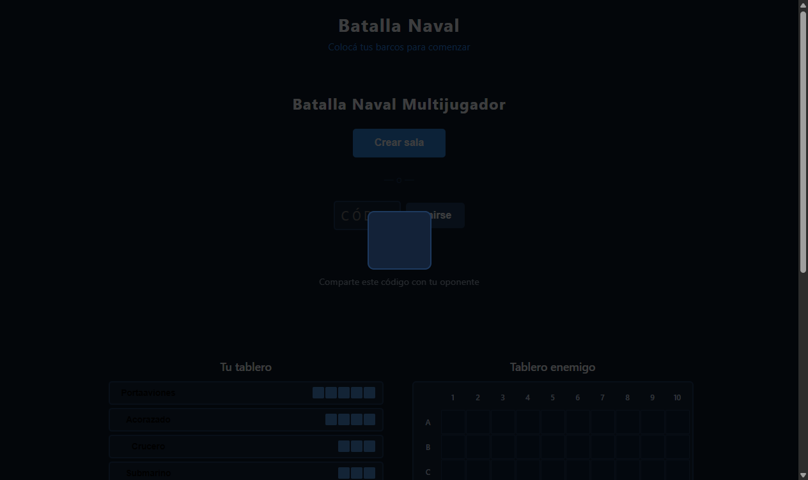

# Sincronización de Estado en Tiempo Real via Firebase

**ADW ID:** yt2puzy
**Fecha:** 2026-02-20
**Especificación:** specs/feature-008-sincronizacion-estado-tiempo-real-firebase.md

## Resumen

Se implementó la sincronización completa del estado de juego entre ambos jugadores usando Firebase Realtime Database. El flujo cubre desde que cada jugador marca "Listo" (sincronizando barcos en Firebase) hasta el fin de la partida con overlay de victoria/derrota, pasando por la detección automática de inicio de combate, indicador de turno en tiempo real y marcado de ataques (hit/miss/sunk) en ambos tableros.

## Screenshots




## Lo Construido

- `js/ui.js` — Módulo ES6 nuevo con funciones de manipulación DOM para la fase de combate
- `js/firebase-game.js` — Extendido con `setPlayerReady` y `submitAttack`; `listenRoom` ampliado con callbacks de combate
- `js/game.js` — Orquestación completa colocación → combate → fin; lógica de hit/miss/sunk
- `index.html` — Elementos HTML para indicador de turno, mensaje de espera y overlay de fin de partida
- `css/styles.css` — Estilos para estados de celdas, indicador de turno, overlay y tablero interactivo

## Implementación Técnica

### Archivos Modificados

- `js/firebase-game.js`: Agregadas funciones `setPlayerReady` y `submitAttack`; `listenRoom` extendido con detección de `onGameStart`, `onTurnChange`, `onAttackReceived`, `onGameEnd`; importado `push` del SDK Firebase
- `js/game.js`: `onReady()` convertido a async con llamada a Firebase; agregadas `installCombatListener`, `startPlayingPhase`, `onEnemyCellClick`, `handleAttackReceived`, `handleTurnChange`, `handleGameEnd`; importado `UI` desde `ui.js`
- `index.html`: Agregados `#turn-indicator`, `#waiting-opponent-msg`, `#game-over-overlay` y `<script type="module" src="js/ui.js">`
- `css/styles.css`: Agregadas variables `--color-hit/miss/sunk`, clases `.cell--hit/miss/sunk`, estilos `#turn-indicator`, `.turn--mine/opponent`, `.board--interactive`, `#waiting-opponent-msg` con animación pulse, `#game-over-overlay` y `.game-over-card`

### Cambios Clave

- **`setPlayerReady(roomId, playerKey, ships)`**: Escribe `ready: true` y los barcos del jugador en Firebase; si ambos están listos, escribe `status: "playing"` y `currentTurn: "player1"`
- **`submitAttack(roomId, attackerKey, cellId, result)`**: Hace `push` del ataque a `rooms/{roomId}/attacks`, rota `currentTurn` al otro jugador y escribe `winner` + `status: "finished"` si `result === "finished"`
- **`listenRoom` extendido**: Usa flags internos (`_gameStarted`, `_lastTurn`, `_lastAttackCount`) para disparar cada callback exactamente cuando corresponde, sin duplicados
- **`onEnemyCellClick`**: Determina hit/miss/sunk/finished comparando `cellId` contra `_roomState[enemyKey].ships`; usa `_attackedCells` (Set) para prevenir doble ataque y deshabilita el tablero inmediatamente al atacar
- **`handleAttackReceived`**: Itera `Object.entries(attacks)` filtrando por `_processedAttackKeys` para procesar solo ataques nuevos; marca en tablero enemigo si el atacante es el jugador local, o en tablero propio si es el oponente
- **`UI` module** (`js/ui.js`): Exporta `setTurnIndicator`, `markCell`, `setEnemyBoardInteractive`, `showGameOver`, `hideGameOver`

## Cómo Usar

1. Abrir `http://localhost:8000` en dos pestañas del navegador
2. En la primera pestaña: crear sala (se genera código de 6 caracteres)
3. En la segunda pestaña: ingresar el código y unirse
4. En ambas pestañas: colocar los 5 barcos en el tablero propio y presionar "Listo"
5. La partida inicia automáticamente cuando ambos jugadores están listos
6. El indicador de turno ("Tu turno" / "Turno del oponente") indica quién puede atacar
7. Hacer clic en una celda del tablero enemigo para atacar (solo cuando es tu turno)
8. Los ataques se marcan en tiempo real en ambos tableros (rojo = impacto, gris = agua)
9. Al hundir toda la flota enemiga, aparece el overlay de fin de partida

## Configuración

```bash
# Servidor de desarrollo
python -m http.server 8000
```

Firebase Realtime Database debe estar configurado con `js/firebase-config.js` (no incluido en el repo). La estructura de datos en Firebase es:

```
rooms/{roomId}/
  status: "waiting" | "placing" | "playing" | "finished"
  player1: { id, ready, ships: { shipId: [cellId, ...] } }
  player2: { id, ready, ships: { shipId: [cellId, ...] } }
  currentTurn: "player1" | "player2"
  winner: "player1" | "player2" | null
  attacks: { pushId: { cell, attackerKey, result } }
```

## Pruebas

**Flujo completo:**
1. Abrir dos pestañas → crear sala en una, unirse en otra
2. Ambas colocan barcos → presionar "Listo" en ambas
3. Verificar que la partida inicia automáticamente (sin recarga)
4. Verificar indicador de turno correcto en cada pestaña
5. Atacar celda enemiga → verificar marcador en tablero enemigo (atacante) y tablero propio (defensor)
6. Hundir todos los barcos del oponente → verificar overlay de victoria/derrota

**Casos edge cubiertos:**
- Doble clic prevenido con `_attackedCells` Set
- Clic en turno ajeno ignorado (`_currentTurn !== playerKey`)
- Race condition benigna en `setPlayerReady` (el segundo write de `status: "playing"` es idempotente)
- Ataques duplicados prevenidos con `_processedAttackKeys` Set

## Notas

- El campo `attacks` en Firebase es un nodo de lista (objeto con pushIds como claves), no un array JS; se itera con `Object.entries(attacks)`
- Los barcos se almacenan en Firebase como `{ shipId: [cellId, ...] }` para permitir comparación directa con `cellId` al determinar hit/miss
- `ui.js` debe cargarse como módulo ES6 antes de `game.js`; se importa con `import { UI } from './ui.js'`
- No se modificó `js/firebase-config.js`
- La review identificó un bug visual en el overlay de fin de partida (ver `assets/03_overlay_bug.png`)
