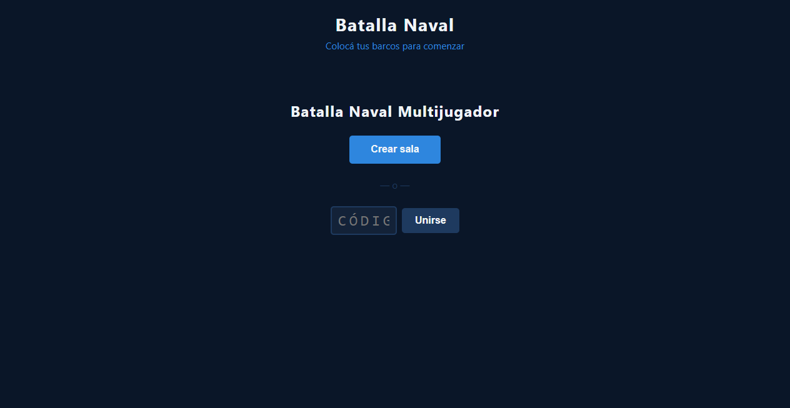
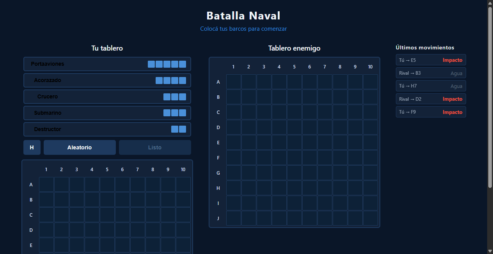

# Mecánica de Ataque y Gestión de Turnos

**ADW ID:** zmttmha
**Fecha:** 2026-02-20
**Especificación:** specs/feature-0013-mecanica-ataque-turnos.md

## Resumen

Se completó la mecánica de ataque en la fase de combate extendiendo `handleAttacksChange` para re-sincronizar los ataques propios en el tablero enemigo desde Firebase y agregando un panel de historial que muestra los últimos 5 movimientos en tiempo real para ambos jugadores.

## Screenshots

## Lo Construido

- Panel `#attack-history` con lista `#attack-history-list` en `index.html`, oculto hasta el primer ataque
- Re-sincronización de ataques propios en el tablero enemigo desde Firebase (robustez ante re-inicio del listener)
- Historial de los últimos 5 ataques ordenados por timestamp descendente, visible en tiempo real para ambos jugadores
- Estilos CSS del panel con soporte responsive (layout horizontal en ≤900px)

## Implementación Técnica

### Archivos Modificados

- `index.html`: agregada `<section id="attack-history" hidden>` con `<ol id="attack-history-list">` dentro de `#game-container`
- `js/game.js`: extendida `handleAttacksChange` para pintar ataques propios en tablero enemigo y renderizar el historial
- `css/styles.css`: agregados estilos para `#attack-history`, `.attack-history-item`, `.attack-history-player`, `.attack-history-result` y media query responsive

### Cambios Clave

- `handleAttacksChange` ahora itera todos los ataques y bifurca por `playerId`: ataques del oponente → tablero propio (`cell-`), ataques propios → tablero enemigo (`enemy-cell-`)
- El historial se ordena client-side por `timestamp` (descendente) y se muestra el slice de los primeros 5
- El panel permanece `hidden` hasta que `attacks.length > 0`; se expone con `historyPanel.hidden = false`
- Cada ítem muestra etiqueta relativa ("Tú" / "Rival"), celda atacada y resultado ("Impacto" / "Agua")

## Cómo Usar

1. Abrir `http://localhost:8000` en dos pestañas del navegador
2. Pestaña A crea sala; pestaña B se une con el código de 6 caracteres
3. Ambas pestañas colocan sus barcos y presionan "Listo"
4. El jugador activo hace clic en una celda del tablero enemigo; el ataque se registra en Firebase
5. El panel "Últimos movimientos" aparece automáticamente tras el primer ataque y se actualiza en ambas pestañas en tiempo real

## Configuración

No requiere configuración adicional. Usa la infraestructura Firebase existente (`registerAttack`, `setTurn`, `listenRoom`) implementada en feature-010.

## Pruebas

1. Iniciar servidor: `python -m http.server 8000`
2. Flujo completo en dos pestañas: lobby → colocación → combate
3. Verificar que el historial aparece tras el primer ataque y muestra solo los 5 más recientes
4. Verificar etiquetas "Tú" / "Rival" relativas a cada pestaña
5. Verificar que el panel está oculto durante lobby y fase de colocación
6. Abrir DevTools → Console en ambas pestañas y confirmar cero errores JS
7. Realizar 6+ ataques y confirmar que el historial nunca supera 5 ítems

## Notas

- La infraestructura base (`registerAttack`, `setTurn`, `handleTurnChange`, estados CSS de celdas, `board--disabled`) fue implementada en feature-010; esta feature solo extiende `handleAttacksChange` y agrega el panel HTML/CSS.
- El ordenamiento del historial y el slice son client-side; no se escribe ningún nodo adicional en Firebase.
- La condición de victoria queda fuera del alcance de esta feature y se evaluará en una iteración posterior.
